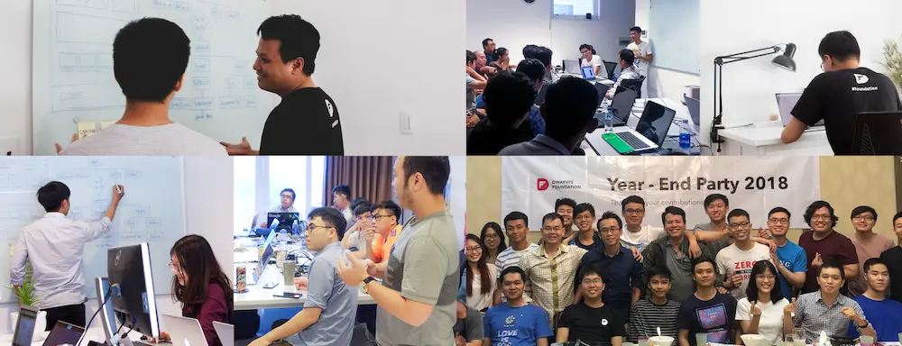

# Dwarves Foundation Employee Handbook
Before 2019, we didn’t have a handbook. In those first five years, when a new person joined the company, they were expected to figure things out for themselves. However, when we grew from a company of 10, 20 employees to a company of over 40, our “introduction by immersion” style stopped working. New hires felt lost and isolated, and their first weeks or even months on the job were stressful because of it. There’s as much to unlearn as there is to learn. Prior to this handbook, navigating that path was both somewhat random and almost entirely oral. 

**So, this is where we’ll try to share what’s worth knowing** about the Dwarves, the company, our culture, our process, and our history. It’s a guide to understanding what people are talking about whether it’s okay to take your vacation when you’ve only been with us for few months (yes), what a benefits package look like, and hopefully everything in-between.

This handbook also offers us an opportunity to clarify who we are as a company. What do we stand for? How should we work? Codifying those beliefs into a handbook makes them tangible and, most importantly, editable. 

**Making the company our best product is a guiding principle**, but we can’t easily improve what we haven’t articulated. So whatever version of this handbook you’re reading, you can be sure it’s not the last. Please do help keep it up to date.

So many of these employee handbook projects turn out to be ideal-case prescriptions rather than real-world descriptions. They cover all the ways people should act, not the ways they do. That’s a sham. Let’s not write a handbook like that. **Let’s keep it honest.**

If you’re reading this just after joining the company, it’s particularly on you. It’s harder for us slowly-boiled frogs who’ve been with the Dwarves for a while to spot the broken ways. Please take advantage of that glorious, shiny ignorance of being new, and question things.

## Sections
* [Dwarves Foundation Is You](dwarves-foundation-is-you.md)
* [Getting Started](getting-started.md)
* [Benefits & Perks](benefits-and-perks.md)

#### Introduction to Dwarves Foundation
* [What We Stand For](what-we-stand-for.md)
* [What We Value](what-we-value.md)
* [Who Does What](who-does-what.md)
* [How We Work](how-we-work.md)
* [Where We Work](where-we-work.md)
* [Making a Career](making-a-career.md)
* [How We Hire](how-we-hire.md)
* [How We Spend Money](how-we-spend-money.md)
* [Tools & Systems](tools-and-systems.md)

#### Guides & Resources
* [Moonlighting](moonlighting.md)
* [Effective Meeting](handbook/effective-meeting.md)
* [Security Rules](security-rules.md)
* [Places to Work](places-to-work.md)
* [Marketing Assets](marketing-assets.md)
* [FAQ](faq.md)

**Process**
* [Leave Request](guides/leave-request.md)
* [Assets](guides/assets.md)
* [Email Communication and Use](guides/email-communication-and-uses.md)
* [Continuing Education Allowance](guides/continuing-education-allowance.md)
* [Reimbursement](guides/reimbursement.md)

## Contributing
We love pull requests. If you have something you want to add or remove, please open a new pull request. Please leave all PRs open for at least a week to get feedback from everyone.

## Credits
Our handbook was inspired from [Basecamp](https://github.com/basecamp/handbook) and customized by the Dwarves team. We love the concise content and the way they organize the handbook.

## License
Creative Commons Attribution 4.0 International (CC BY 4.0)
@ [Dwarves Foundation](https://d.foundation)
