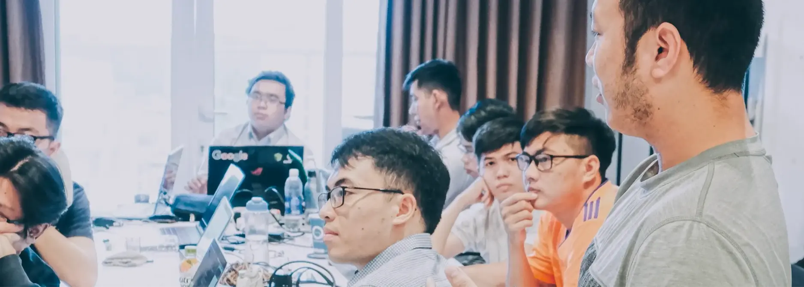

We run Dwarves as an open company/community.

Dwarves Community is melting pot for software engineers, thinkers, learners and techies who are to explore, learn and master the latest advancements in technology.

Technology is moving at the speed of light, and we want to stay at the forefront. Background or experience doesn’t matter to us, we are more keen on the mindset of always being curious about what’s next in tech, collaborating for the better, learning profusely and sharing unconditionally.

- [ICY](community/icy.md)
- [Memo](community/memo.md)
- [Discord](community/discord.md)
- [Radar](community/radar.md)
- [Earn](community/earn.md)

## How our community started

We believe great software comes from working together. Many consulting firms keep knowledge inside their walls. We wanted to try something new. Could we keep clients happy while creating a space for learning and sharing? This led us to create the [Dwarves Network](https://discord.gg/dfoundation), a community that goes beyond our team to include coders, students, and tech lovers who share our passion for good work.

Discord became our main hub. We set up channels for work and public talks where anyone can join tech discussions. We changed company meetings into community events. Our team all-hands meetings became Monthly Community Calls, where team members and community folks share updates and ideas.

We added radio talks in Discord's stage channels for casual sharing. To thank people for helping, we created [ICY](https://icy.so), our blockchain token that rewards good contributions from anyone, whether they work for us or not.

This setup grew through trying things out. Now it's a big part of who we are. We call ourselves an open learning network for tech people, which fits what we've become: a consulting company with a open learning community around it.

## How our community runs

The Dwarves Network works on a few simple ideas:

[Discord](https://discord.gg/dfoundation) is our main space, with channels set up for different needs. This lets us do focused work while having open tech talks.

We replaced closed company meetings with open ones. Our Monthly Community Calls and radio talks welcome anyone interested in our work and the tech we use.

Team members and community folks earn ICY tokens for good contributions on Discord or our [Memo site](https://memo.d.foundation/). This rewards value creation from anyone.

We call ourselves an open learning network for tech people, showing our focus on sharing knowledge beyond company lines.

## Lesson learned from building community

Running Dwarves this way has taught us a lot. Here are our main takeaways:

### Fresh ideas flow when given direction

Opening our doors brought in new thinking. Ideas from Discord talks have helped client projects, and community content shows off our shared knowledge. But community talks need a clear purpose. Without direction, conversations can wander. We balance openness with focus, asking: "How can our community help our consulting work?"

We find ways to involve community members in projects through testing or feedback. This creates a cycle where our work informs the community, and community insights improve what we deliver.

### Good communities need care

Our Monthly Community Calls and radio talks build real connections. The ICY token system adds a fun element that keeps people involved. Running a good community takes resources. Watching discussions, planning events, and running the token system take time. We balance this work with our consulting duties.

We're still figuring out the money side. Should the community make its own income through referrals or paid offerings? Or should it be supported by our consulting work? These questions matter for our future.

### Openness builds trust

Being an open learning hub has helped our reputation. Clients see us as forward-thinking, and talented people like our sharing culture. We have clear guidelines for sharing that keep the right balance. This helps us maintain a healthy space where both client work and community learning can grow. As we get bigger, we think about how to scale well. Success means keeping clients happy while growing a healthy learning space.

### Smart rewards improve participation

Our ICY token system has sparked many contributions on Discord and our Memo site. People love sharing knowledge when their work gets noticed. We focus on quality over quantity. We've fine-tuned our approach to reward good contributions, not just lots of posts. We also think about ICY's long-term value and how token holders can benefit in ways that match our community goals.

### Our culture makes us special

Our model shows our core values: openness, curiosity, and teamwork. It gives us a unique identity and attracts like-minded people. Keeping this culture gets harder as we grow. New members need good onboarding to understand how we work, and we solve differences thoughtfully to keep our positive vibe. We often ask: What shared values bring our team and community together? How do we welcome newcomers while keeping what makes Dwarves special?

## Looking ahead

The Dwarves Network is still growing. It already brings big benefits: better ideas, stronger ties, and a unique market position. But we're still learning as we go. Our big questions now are: How can the community boost our consulting work? How do we measure success? And how do we explain this model to members who might not be familiar with it?

If you're part of Dwarves, as an employee or community member, we want your thoughts. What works well? What could be better? Let's build this together. Balancing consulting and community isn't always easy, but it creates something better than either could alone. That's the Dwarves way.

## Our community channels

- [Memo](https://memo.d.foundation/) - Our knowledge repository
- [Discord](https://discord.gg/dfoundation) - Our main hub for discussions
- [Github](https://github.com/dwarvesf) - Where we share open source code
- [Website](https://d.foundation/) - Our official site

---

> Next: [ICY](community/icy.md)
