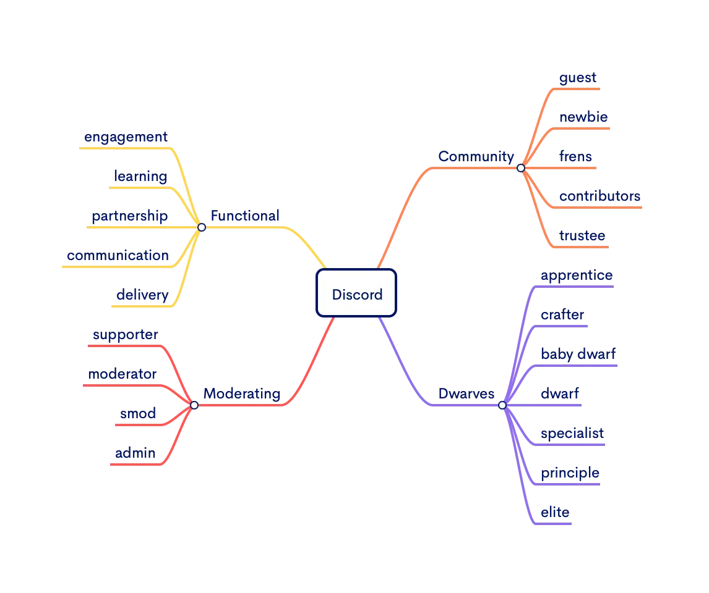

We know there are countless Discord servers out there. Ours aims to be different. From the start, we designed it as a space *for developers*, prioritizing genuine connection and knowledge sharing over corporate speak. We operate it as a blend of company and community because we believe that's the most valuable approach.

So, what actually happens here?

* **We share knowledge:** We discuss software insights through seminars, casual channel chats, and tech talks. If it's about development, it's welcome.
* **We connect with people:** This is our virtual space to hang out with friends, alumni, and like-minded developers. No forced networking.
* **We build in the open:** We're creating a software network people genuinely want to join. Discord is central to that effort.

We recently reorganized the channels to hopefully make navigation and connection easier. Here's a breakdown:

## Where stuff happens: the channels

Channels fall into two main categories: common areas for everyone and spaces more focused on our internal consulting work.

### Community hangouts (everyone welcome)

* **off-topic:** For general, non-work conversations.
  * `⛺・random`: The place for memes, weekend stories, pet pictures, and anything else off-topic.
  * `📈・trading-cafe`: Discussions about markets, crypto, and trading.
* **research:** The hub for technical discussions.
  * `🌟・starboard`: Notable messages highlighted by the community land here.
  * `💡・til`: Share your "today I learned" moments, big or small.
  * `💻・tech`: General technology discussions, news, and questions.
  * `🎒・topics`: Focused discussions on specific technical subjects.

### Internal & ops channels (mostly for staff & mods)

* **project:** Discussions related to active client projects (primarily for our consulting team).
* **consulting:** The main area for internal team communication.
  * `🏢・lobby`: General company-wide announcements and discussions.
  * `🦄・pink-alert`: For urgent matters needing immediate attention.
* **moderation:** Keeping the community running smoothly.
  * `🗣・community`: Coordination for community initiatives.
  * `🎗️・operation`: Server management and administrative tasks.
* **misc & log:** Essential background channels.
  * `🤖・bot-commands`: Interacting with server bots.
  * `🧊・icy-log`: Automated server activity logs.

## Who's who: Discord roles

We needed a role system that reflects contribution and expertise as we grow, not just arbitrary labels. Our system combines ladder-based roles (earned through participation) and function-based roles (based on responsibilities).

Why this structure? We want to recognize engagement and skill, eventually linking roles to tangible benefits like NFTs and `$icy` staking (more details soon). It's about creating a system that rewards active participation.

### The core MMA roles (mastery, meaning, autonomy)

This system recognizes different types of impact:

* **@labs (mastery):** Your technical skill is recognized and valued by the community.
* **@sers (meaning):** You make meaningful contributions, through quality work or positive community involvement.
* **@chad (autonomy):** You consistently deliver high-quality work effectively and reliably.

### Keeping the lights on (moderation)

* **supporter:** Welcomes new members and helps with daily questions.
* **moderator:** Organizes events, facilitates discussions, and may host talks.
* **smod:** Oversees major community and operational functions.

### Community crew

* **guest:** The starting role for everyone.
* **newbie:** Granted after basic introductions. Welcome aboard!
* **frens:** Actively participates in public channels.
* **contributor:** Helps bring new, valuable members into the community.
* **trustee:** A recognized and trusted voice within the community.

### Consulting staff (our internal team structure)

* **apprentice:** Team members new to Dwarves.
* **baby dwarf:** Developing their focus within the team.
* **dwarf:** Actively participates in R&D and learning.
* **crafter:** Consistently delivers quality software.
* **specialist:** Possesses deep expertise in a specific domain.
* **principle:** Helps maintain and elevate the team's standards.
* **elite:** Guides the team's technical direction.

### Functional roles (what people focus on)

These roles represent key operational areas:

* **engagement:** Aligns the team around vision and values.
* **learning:** Promotes continuous skill development.
* **partnership:** Focuses on client relationships and project acquisition.
* **communication:** Ensures transparent information flow.
* **delivery:** Oversees the quality and shipment of work.

## Our helpful bots

Being developers, we've built bots to automate tasks and add useful features:

* **Mochi:** A tipping bot using `$MOCHI`. Use `!tip` to give a virtual high-five for helpful answers or contributions.
* **Tono:** Our primary server management bot, handling roles and background tasks.
* **Fortress:** An internal tool for tracking performance and issues (less community-facing).

## How do I level up? (the `$icy` system)

We use our custom token, [`$icy`](icy.md), as the server's primary internal currency – think of it as community points.

You earn `$icy` through activity and contributions. Higher engagement leads to more `$icy`, which helps you climb the role ladder.

Achieving certain roles will also eventually grant a boosting NFT, providing tangible value back to our most active members.

That covers the basics! Feel free to jump into a channel and introduce yourself.

See you [on the server!](http://discord.gg/dwarvesv)

---

> Next: [Earn](earn.md)
