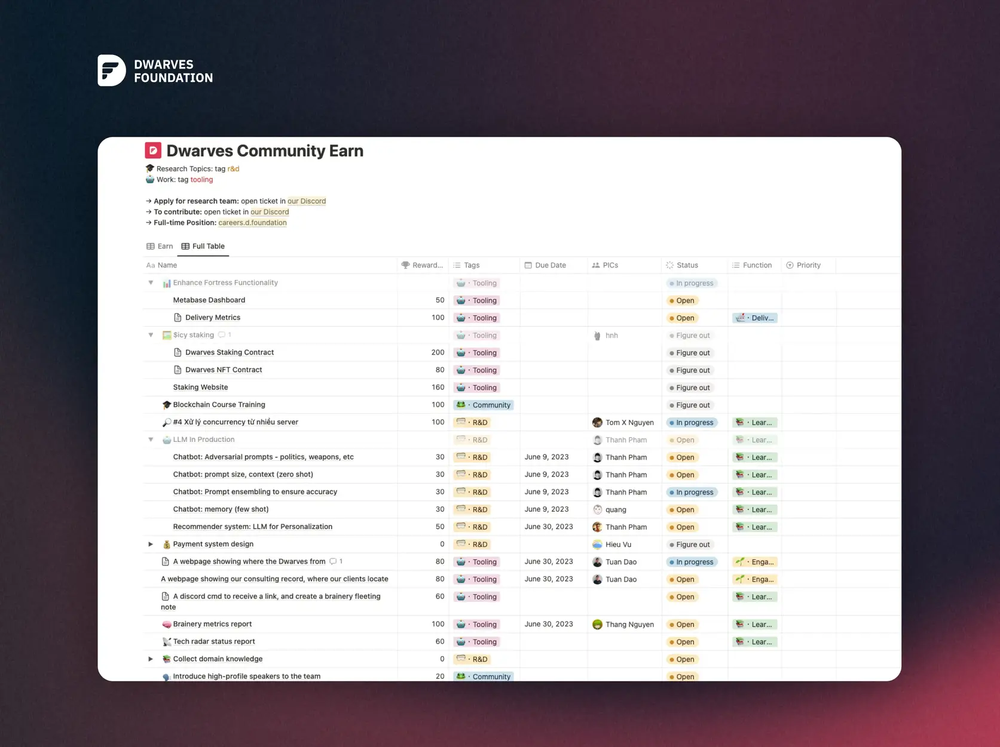

Our [Dwarves Discord network](discord.md) is the space where we connect with friends, alumni, and other like-minded developers.

One way we encourage collaboration and skill growth is through **bounties**. These are tasks that reward community members with our token, **$ICY**, for contributions. Bounties often involve work outside a developer's primary skillset, offering a chance to learn and contribute in new ways.

### Who can participate?

Our bounty program provides opportunities for developers looking for interesting challenges and a way to connect with others.

- The program is open to anyone with the necessary skills for a specific bounty.
- Common skills needed include writing, design, research, development, and finance analysis.

### How it works

First, join our Discord server. If you haven't already, say hello in the `😀・arrival` channel.

1. **Check the bounty board:** Visit <earn.d.foundation> to see available tasks.
2. **Claim a bounty:** Select a bounty you want to work on and claim it by opening a ticket in the `⁠🎫・support-ticket` channel on Discord.
3. **Deliver the work & get paid:** Complete the bounty requirements. Once your contribution (usually a Pull Request on GitHub) is approved and merged, you'll receive your $ICY reward.

### Rewards

We allocate a monthly pool of **1700 $ICY** (roughly equivalent to $2,500 USD, though the value fluctuates) for the bounty system.

You can use your earned **$ICY** to redeem exclusive Dwarves swag or swap it for USDC.

Please note: Rewards are paid out _after_ the corresponding Pull Request (PR) is accepted and merged into the relevant Dwarves GitHub repository. We aim to create a welcoming environment for contributors, and bounties are a key part of that.

---

> Next: [Sharing](sharing.md)
