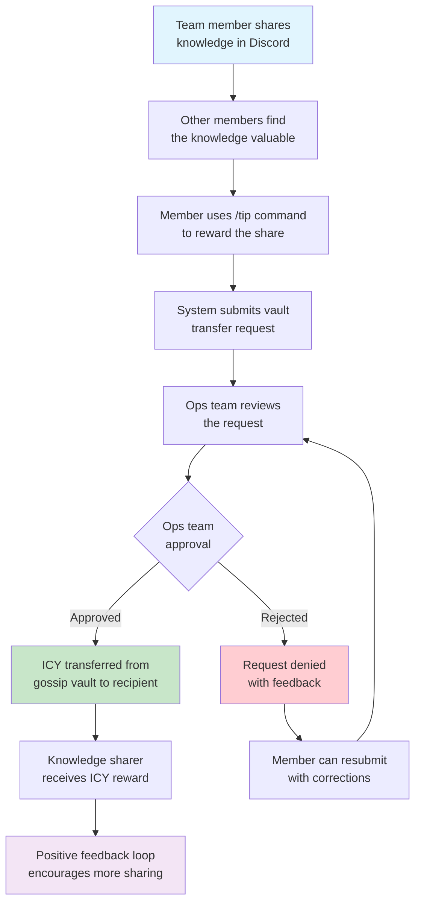

Knowledge moves fast in tech. By the time you schedule a formal presentation, that breakthrough insight might already be old news. Our gossip protocol rewards the spontaneous moments when someone drops valuable knowledge in casual conversation.

It's the missing piece between structured [knowledge sharing](sharing.md) and our [tech transfer framework](transfer.md). While formal presentations have their place, some of the best learning happens in casual exchanges: "Hey, I just figured out a cleaner way to handle state management" or "That API issue? I found a workaround."

The gossip protocol captures these moments, creates immediate positive feedback, and ensures valuable insights spread quickly without getting lost in the noise.

## How it works

When someone shares useful knowledge in Discord, others can immediately reward them using our tip system. Instead of tipping from personal [ICY](icy.md) balances, they draw from our shared "gossip vault." The company funds the reward, not the individual.

This creates a win-win: knowledge sharers get rewarded, receivers don't pay out of pocket, and valuable information spreads quickly through the team.

## The process

Use `/tip @username amount` in Discord to reward valuable knowledge shares. Instead of spending your own ICY, you draw from our shared gossip vault. Our ops team reviews each request to ensure genuine knowledge sharing, then approves the ICY transfer within a few hours.

## What qualifies for rewards

Not every casual comment needs a tip, but these types of shares definitely qualify:

- Quick solutions to common problems
- New tool discoveries or setup tips
- Workarounds for tricky technical issues
- Insights from recent experiments or client work
- Links to valuable resources with context
- "I just learned" moments that others can benefit from

## How to use gossip protocol

**Share knowledge immediately**: When you discover something useful, drop it in Discord with enough context for others to apply it. Don't wait for the perfect moment.

**Recognize value quickly**: Use the tip system when someone's knowledge helps you. Even small tips (5-10 ICY) matter. Include a brief message about how it helped.

**Examples of good shares**:

- "Just found out you can use `--dry-run` with that deployment script to test changes first"
- "That React hook issue we discussed yesterday, turns out the dependency array was the problem. Here's what fixed it: [code snippet]"
- "This debugging extension saved me 2 hours today: [link + brief explanation]"

The gossip protocol makes knowledge sharing natural, immediate, and rewarding. In a world where information moves fast, teams that share knowledge quickly have a significant advantage. This system helps us become that kind of team, where everyone benefits when knowledge flows freely.

---

> Next: [ICY Token](icy.md)
