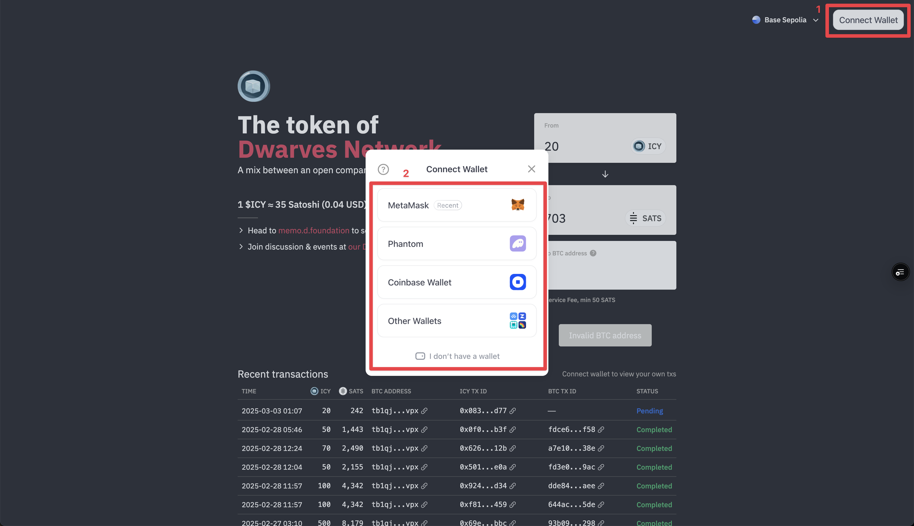
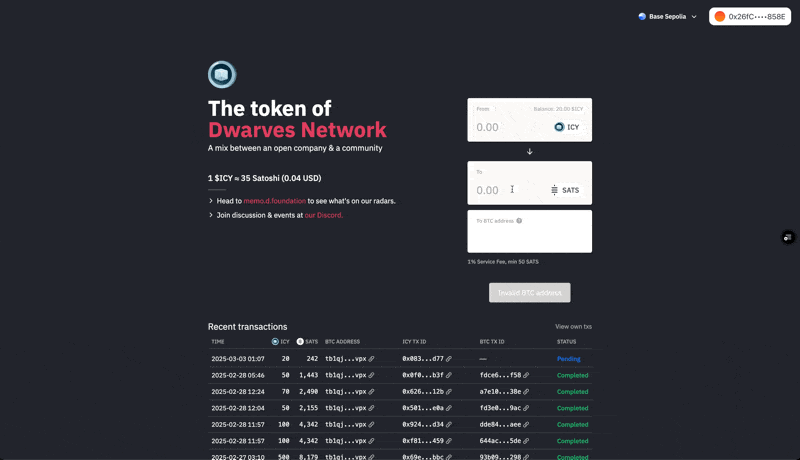
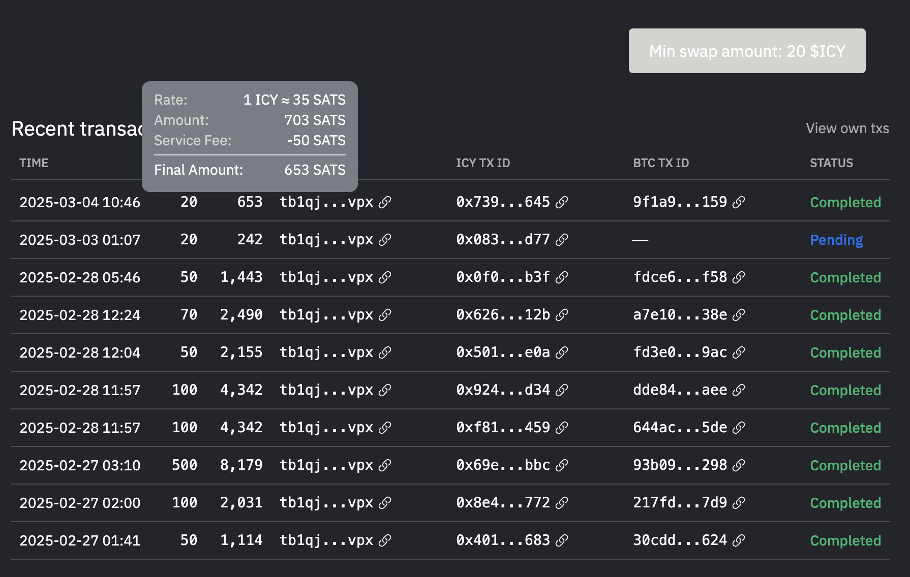

Ready to convert your ICY to Bitcoin? We've made the process simple and secure. Let's walk through it together.

## Getting started

Before you begin, you'll need two things: a Bitcoin (BTC) wallet to receive your funds and some ETH on the Base network for gas fees. Don't have a BTC wallet? No problem! You can set one up using trusted providers like Electrum, Trust Wallet, or UniSat. If you need help with ETH for gas fees, just reach out to our team on the Dwarves Foundation Discord—we're here to help!

## Step 1: Connect to icy.so

First, visit [icy.so](https://icy.so) and click "Connect Wallet" to select your preferred wallet (MetaMask, Coinbase Wallet, etc.). Follow the connection prompts, and make sure you're on the **Base network**.

## Step 2: Make the swap

Once connected, you'll need to select **ICY** as your source token and **BTC** as your destination token. Enter the amount you want to swap (remember, the minimum is `20 ICY`), input your **BTC wallet address**, and click "Swap". You'll need to confirm the transaction in your wallet.

## Step 3: Track your transaction

After confirming, you can watch your transaction in the "Recent Transactions" section. Hover over the transaction to see details, including the service fee. Wait for the "Pending" status to complete.

Processing time varies based on network conditions, gas fees paid, and system load. Don't worry if it takes some time—we ensure 100% of transactions are processed.

## Important details to remember

Keep these key points in mind when swapping your ICY:

- The minimum swap amount is `20 ICY`
- Each transaction has a service fee of `3,000 units`
- Gas fees are paid in ETH on the Base network
- Processing may be delayed during high network activity

Need help? Our team is always ready to assist on the Dwarves Foundation Discord. We're here to make your ICY swap experience smooth and successful!
