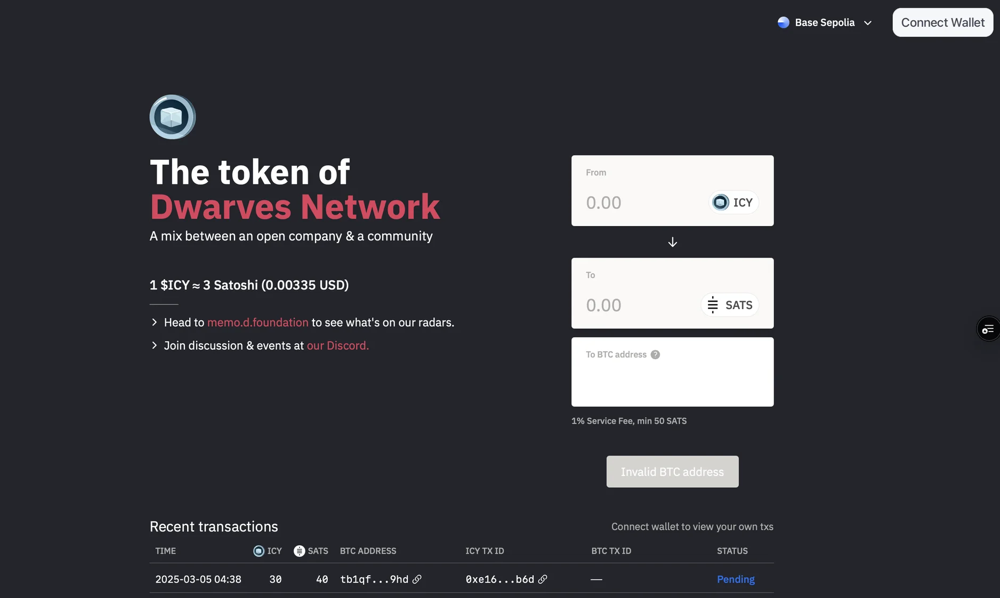

We're excited to share a significant update about ICY's value model. We've moved from a fixed USDC-backed system to a dynamic Bitcoin-backed model. This change brings new opportunities and considerations for ICY holders. Let's break down what this means for you.

## The old model: Simple and stable

Previously, ICY had a straightforward value proposition. Each ICY was worth exactly `1.5 USDC`, and this value remained constant regardless of market conditions. This made it easy to understand and trade, providing stability and predictability for our community.

## The new model: Dynamic and Bitcoin-backed

Now, ICY's value is tied to Bitcoin (BTC) through our liquidity pools. We manage two separate pools, one for ICY and one for BTC, and the interaction between these pools determines ICY's value. The initial conversion rate is set at a predetermined ratio, but the value will fluctuate based on BTC's price and pool dynamics.

### What this means for you

Your ICY's value now depends on three main factors:

- Bitcoin's current market price
- Liquidity pool conditions
- Overall market demand for ICY

Let's look at how these factors work together.

When we add BTC to the pool, it makes ICY more valuable because each ICY is backed by more Bitcoin. Conversely, when we add more ICY to the pool, it reduces the value because each ICY is backed by less Bitcoin.

### Real-world examples

Let's look at how this plays out in practice.
Let's say we start with `1 ICY` being worth `0.00003 BTC`. If Bitcoin is trading at `$50,000`, your ICY would be worth `$1.50`. If Bitcoin's price rises to `$60,000`, your ICY would increase in value to `$1.80`.

Now, let's see how liquidity affects the value. Starting with the same setup (`1 ICY = 0.00003 BTC` at `$50,000`), if we add more BTC to the pool, the ratio might shift to `1 ICY = 0.000035 BTC`, increasing your ICY's value to `$1.75`. On the other hand, if we add more ICY to the pool, the ratio might shift to `1 ICY = 0.000025 BTC`, decreasing your ICY's value to `$1.25`.

### How we manage liquidity

We follow a structured approach to maintain the pools. We add Bitcoin monthly at market prices, and we mint ICY weekly for company activities and rewards. This regular management helps ensure stability while allowing for market-driven value changes.

## Why we made this change

While the USDC model was simple and effective, we believe in evolving with the crypto ecosystem. This new model offers several advantages: it provides growth potential tied to Bitcoin's performance, reduces our dependency on stablecoins, creates a more dynamic and market-driven system, and better reflects real-world trading conditions.

The value of your ICY will now fluctuate based on market conditions. We recommend staying informed about Bitcoin's performance and liquidity pool dynamics to make informed decisions about your ICY holdings.
