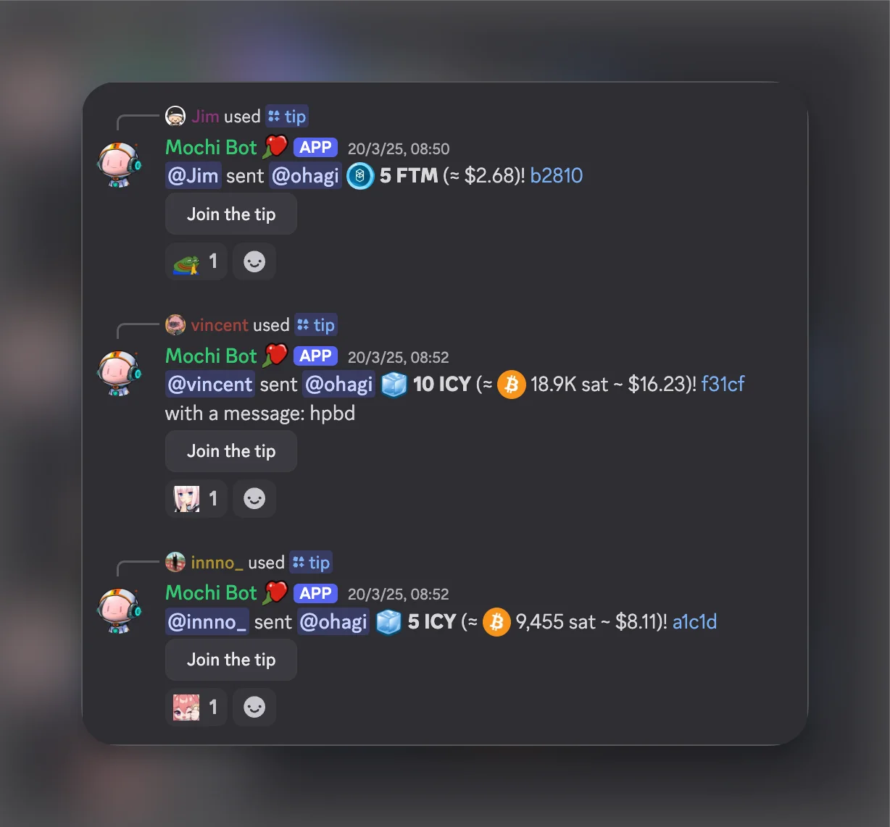
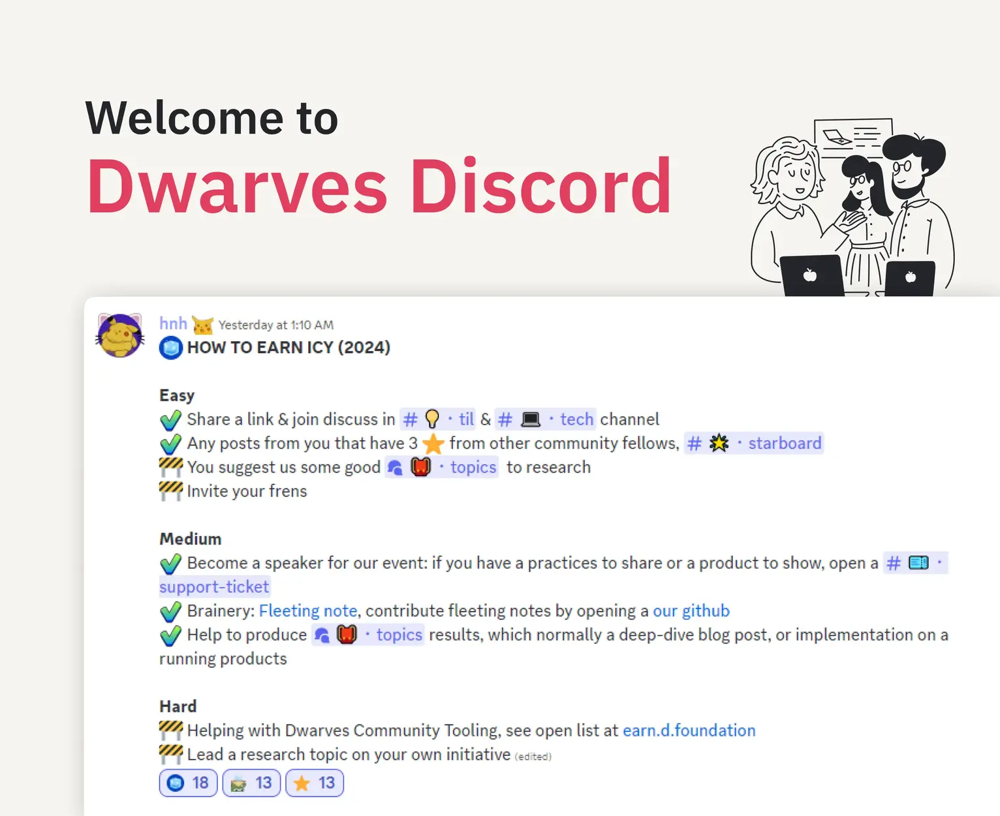

## What is ICY? 🧊

ICY is our way of building a borderless software company through web3 technology. Since 2020, we've used ICY to create a culture where every contribution matters. As a community of software engineers, thinkers, and tech enthusiasts, we're constantly exploring and mastering the latest technology together.

Think of ICY as more than just a token, it's your stake in our community's growth. The more you contribute, the more you can earn and benefit from our collective success.

## How ICY works

We believe in recognizing and rewarding valuable contributions. ICY connects community activities with tangible rewards. You can earn ICY through various activities and use it for benefits, including the opportunity to exchange it for Dwarves stock. This system helps us maintain a culture of collaboration and continuous learning.

## Understanding ICY's value

ICY's value is backed by Bitcoin (BTC) in our treasury. This means your ICY's worth moves with Bitcoin's market value. Here's what affects your ICY's value:

- The Bitcoin we hold in our treasury
- How many ICY tokens are in circulation
- Market demand and liquidity

We maintain two liquidity pools, one for ICY and one for BTC. We add Bitcoin monthly at market prices and mint ICY weekly to reward activities. This setup ensures your ICY maintains real value backed by Bitcoin.

More at: [icy worth](icy-worth.md)

## Ways to earn ICY

### Easy ways to get started

Share your knowledge and engage with our community:

- Share and discuss interesting links in our tech and TIL channels
- Get recognized by community members for your posts
- Suggest research topics
- Invite friends to join our community

### Medium-level contributions

Help build our knowledge base and events:

- Give talks or share your expertise
- Contribute to our brainery with fleeting notes
- Help produce research topics
- Create implementation examples

### Advanced contributions

For those ready to take on more responsibility, we offer opportunities to take on leadership roles and build tools. You can help develop Dwarves community tooling, creating solutions that enhance our collective experience. You can also lead research topics on your own initiative, guiding others through complex technical explorations.

### Special moments we celebrate

We love celebrating life events and achievements within our community. These special moments include birthdays, welcoming new family members, earning certificates, hosting community events, providing actionable feedback, and proposing new initiatives. Each of these milestones represents growth and connection within our ecosystem.

## Research and development opportunities

You can contribute to our knowledge base through various activities that help us all learn and grow. This includes sharing valuable links in tech channels, creating fleeting notes to capture initial ideas, writing permanent notes that solidify concepts, completing full topic research that dives deep into subjects, and participating in [OGIF](sharing.md) sessions where we explore new technologies together.

## Using your ICY

Visit [icy.so](https://icy.so) to redeem your ICY. You can:

- Exchange it for USDC or Bitcoin at [icy swap](icy-swap.md)
- Withdraw it to your wallet
- Use it in our upcoming ICY store

## Technical details

ICY runs on the Base chain. You can find our contract at `0xf289e3b222dd42b185b7e335fa3c5bd6d132441d` via [basescan](https://basescan.org/token/0xf289e3b222dd42b185b7e335fa3c5bd6d132441d).

## What's next for ICY?

We're working on exciting new features for ICY's future development. Our roadmap includes salary advances for full-time team members, enhanced Discord integration for seamless community interaction, direct bank withdrawals to simplify the conversion process, ICY staking opportunities to reward long-term holders, and NFT integration possibilities to expand the ecosystem's utility and creative potential.

---

> Next: [Discord](discord.md)
