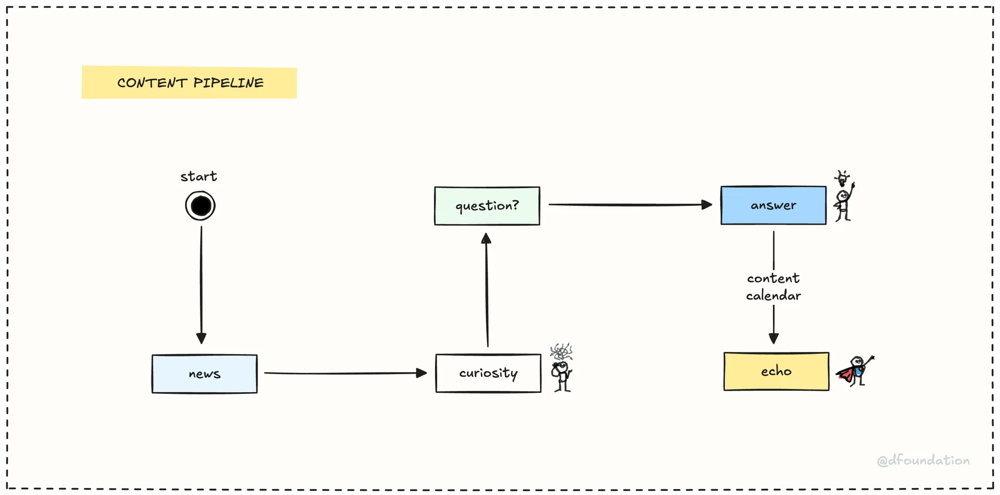

Every company has stories. We just happen to have _lots_ of them – tales of building teams, surviving milestones, how we live, how we work. We share these stories, our learnings, and pretty much everything else on [Dwarves Memo](https://memo.d.foundation). Think of it as pulling back the curtain so you can understand us better.

## What's memo all about?

Fundamentally, Memo is our **public learning engine**. It's where we capture the 1% improvements, the experiments, the hard-won lessons. Written by Dwarves, for product craftsmen (and anyone curious).

You'll find:

- **Team research & deep dives:** Notes on new tech, case studies, technical blogs.
- **Company stuff:** Updates, year-end recaps, how we operate.
- **Culture bits:** Our values, facts, figures, what makes us tick.
- **Podcast transcripts:** Notes from webinars and interviews.
- **Playbooks & handbooks:** Like this very page!

Basically, if it's documented and worth sharing, it probably lives on Memo.

## Why we do it this way

Memo is central to how we share knowledge and attract like-minded folks. If you want the business jargon, you could call it our "inbound strategy." We're not big on pushy outbound sales or marketing. We prefer being a "calm company," giving our team space to explore, experiment, and figure out the next big thing.

The valuable stuff that comes out of that work? It lands on Memo.

## The content pipeline

How does stuff actually get published? It looks something like this:

1. **News & curiosity:** We learn something new, work on a project, or just get curious.
2. **Question & answer:** We explore it, document findings, answer the questions that arise.
3. **Content calendar & echo:** The refined "answer" gets scheduled by our comms team and published (echoed!) on Memo and other channels.

Our comms team helps polish and schedule posts, making sure things look good before they go live.

## How to contribute

Please do! Memo is built on Markdown files stored directly in our [GitHub repository](https://github.com/dwarvesf/memo.d.foundation) (the same one that powers the site via GitHub Pages). Getting your thoughts published is pretty straightforward:

1. **Create or edit a markdown file:** Find the right spot within the `vault/` directory structure (e.g., `vault/engineering/`, `vault/culture/`). Create a new `.md` file or edit an existing one.
2. **Add frontmatter:** This YAML metadata at the _very top_ of your file is crucial for the site generator. Include at least these fields:
   - `title`: The main title for your post.
   - `description`: A short, tweet-length summary of your post.
   - `tags`: Relevant keywords (e.g., `blog`, `engineering`, `react`, `case-study`). `handbook` and `memo` are good general tags.
   - `author`: Your GitHub username or identifier used in the system (e.g., `tieubao`).
   - `date`: `YYYY-MM-DD`.
3. **Formatting:**
   - Use standard Markdown headings (`#`, `##`, `###`). Keep it simple – `###` should generally be the deepest level. Use **bold** for emphasis if needed, not smaller headings.
   - Keep paragraphs relatively short and focused. Use lists, images, and code blocks where helpful.
4. **Submit a pull request:** Commit your changes and open a PR against the main branch of the repository. Once reviewed and merged, GitHub Pages will automatically rebuild the site, and your post will appear on [memo.d.foundation](https://memo.d.foundation).

## Content elevation

We loosely follow a Zettelkasten-like idea. Quick notes or initial findings might start as simple Markdown files or drafts within the repository (perhaps in a personal fork or a specific drafts area). As ideas mature and become more robust, they get refined, given proper frontmatter, and moved into the main `vault/` structure to become official Memo posts via the PR process.

We genuinely encourage everyone to contribute. Your voice, your experiences – that's what makes Memo valuable. Nothing reveals who we are better than the people living it every day.
