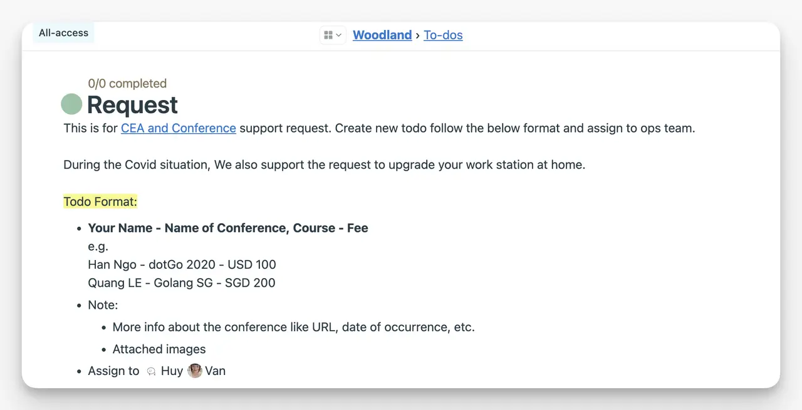

## Frequently Asked Questions

Here are answers to common questions about working at Dwarves. If you don't find what you're looking for, please reach out to us directly.

## Practicalities

### How do I change my personal information?

Your personal information is secure in our HR system. To update your details, reach out to our HR team at <ops@d.foundation>. They'll guide you through the process.

### I'm thinking about moving. How should I prepare?

If you're considering relocating, please notify <ops@d.foundation> at least two weeks before your move. This gives us time to update your shipping information and ensure you continue receiving any physical mail without disruption.

### Do you provide benefits?

Yes, we offer a comprehensive benefits package including health insurance and retirement plans. For detailed information about your specific benefits, contact <ops@d.foundation>.

### Can I get business cards?

Absolutely. If you need business cards, email <ops@d.foundation> with your details (name, title, email, phone number). We'll design and ship them to you.

### What communications am I required to read?

We expect everyone to stay up-to-date with:

- Important announcements in Basecamp
- Messages directed personally to you
- Your project-related communications

We don't expect you to read everything in Basecamp or every message in every channel. Focus on what's relevant to your work and team.

### What are the communication expectations?

We believe in asynchronous communication. This means:

- You don't need to respond to messages immediately
- Taking time to consider your response is valued
- We trust you to manage your communication schedule

If something is truly urgent, we'll make that clear and reach out through appropriate channels.

### Do we have a dress code?

We don't have a formal dress code. For client meetings (in-person or video), business casual attire is appropriate. For everyday work, wear what makes you comfortable and productive.

### What do I do when I can't make it to a meeting?

Life happens. If you can't attend a scheduled meeting:

1. Notify the meeting organizer as soon as possible
2. Update your calendar status
3. If needed, ask someone to share notes with you afterward

For recurring team meetings, consistent participation is important. Try to prioritize these when possible.

### How do we deal with conflicts?

When conflicts arise:

1. Start with direct, honest communication with the person involved
2. If that doesn't resolve the issue, involve your team lead
3. For more serious concerns, please speak with Han

We believe most conflicts can be resolved through open conversation and mutual respect.

### What if I need to take time off?

We value work-life balance and encourage taking time when you need it:

1. Request time off through our HR system
2. Provide at least two weeks' notice for planned absences
3. For unexpected situations, notify us as soon as possible

Please coordinate with your team to ensure project work is covered during your absence.

### What if I'm sick?

Your health comes first. If you're sick:

1. Take the time you need to recover
2. Notify your team lead and project teammates
3. Don't worry about logging sick time unless it extends beyond three consecutive days

We trust you to manage your health responsibly and return when you're well.

### What educational and professional opportunities are available?

We're committed to your growth and development:

- Annual learning stipend
- Conference attendance opportunities
- Mentorship programs
- Technology workshops and internal knowledge sharing

Speak with your team lead about your professional development goals, and we'll help support your journey.

## People Operations

### The Culture

**How to pronounce the company name?**

Dwarf is one of the hardest words to pronounce to the non-English speaker, but that's what made we special.

- Checkout [how to pronounce dwarf on YouTube](https://youtu.be/3MJ1_blsY_s)

- **/dwɔːf/**: It's like 'đ-ô-p' with a 'tr' in between -> /đ-tr-ô-p/

**Just in case people don't get it?**

We can give them the alias email **@d.foundation**

**Do we have a theme song?**

An intern randomly suggested not an official one but a theme song in 2017 [DragonForce - Three Hammers](https://youtu.be/kVIGju-rSho)

**One word to describe Dwarves Foundation value?**

Software Craftsmanship

**One sentence to describe Dwarves Foundation?**

Empower Innovation with Software Craftsmanship

**Do we have HR?**

We don't have the HR department. We aim to build a flat and transparent organization where everything runs around the mission. The Ops team takes care of hiring and training their team members.

We only have an admin to take care of the paperwork. If you have any question, you can ask your team lead or the admin.

**How about the working hours?**

We care about the quality of the work we produce rather than the number of hours worked. However if you prefer to have a fixed schedule, we recommend to start at 8am and end at 5pm as stated in [Flexible Working Hours](benefits-and-perks.md#flexible-working-hours)

**How about the dress code?**

We don't really have the dress code, but everyone is expected to be well-groomed and wear clean clothing, free of holes, tears, or other signs of wear.

Clothing with offensive or inappropriate designs or stamps is not allowed. Clothing should not be too revealing.

### Employee contract

As our employees demand having a credit card or borrowing from the bank, which requires proof of income, our team supports members by providing the proof of income letter and labor contract.

**How does the team provide proof of income letter?**

We will provide either or both types of the contract, depending on the individual, to certify your monthly income:

- A US contract
- A Vietnam contract

**Who should I contact to get the proof of income?**

Please open a ticket and ping @Gthan and @hnh.

**How can I get the form for the proof of income letter?**

Please ask the bank to provide the desired form for the income verification letter.

### Team email

Dwarves Team uses Google Mail service to provide a true mailbox for members working on the client side. For others, the team will provide a virtual mailbox using the alias which is forwarded to the personal mailbox.

**How to access email alias?**

- You can access the email alias when you are an official member of Dwarves Foundation. You will have a walkthrough about this with the ops team.
- Open a ticket, and ping Quang to activate the alias.
- Follow the [instructions](guides/configure-company-email.md) here to add the alias to your email

**How to send email using alias?**

- Make sure you follow this [instruction](guides/configure-company-email.md) and setup this email successfully.
- Open the New Message box, select the alias that you want to send from

### Benefit

#### Education allowance

The Education Allowance is part of our Benefits & Perks package designed to support your growth through learning and experimenting with new technologies. You will receive an annual budget to help you achieve your learning and development goals, whether it's for books, courses, or conferences.

If you're interested in taking classes that you feel will improve you professionally or personally, here's what you need to know:

**Who is eligible to receive it?** \
This benefit is available to any full-time Dwarf who has been with us for more than 6 months.

**What is the limit?** \
You have a $300 annual stipend for your educational pursuits.

**How do I submit a request?**

To get approval, you need to provide some form of output, such as a certificate (for courses) or a report (for conferences). Once approved, you will receive the reimbursement through [Woodland > Expense.](https://3.basecamp.com/4108948/buckets/9403032/todolists/1557155199)

#### Bao Minh insurance

[Bao Minh Insurance](https://www.baominh.com.vn/) is a health insurance provided by Bao Minh Company. All employees have a quota for medical check-ups based on specific categories.

**Basic conditions for receiving the Bao Minh Health Insurance card for full-time employees**

- Passed probation
- Do not require the company to pay Social Insurance (SI) and Health Insurance (HI).
- Be one of the core members of the DF team, voted as an outstanding employee of the previous year, or a top contributor to the team's advocacy & learning activities.

- _Note: Some members have SI and HI still receive the Bao Minh insurance card due to needing extra coverage or as a reward for their contributions. These cases are handled individually, and the team may consider publicizing this policy to motivate employees._

Starting in 2023, the team switched to using Bao Minh virtual cards for easier use and information storage.

**How will the insurance card be received?**

- The Ops team will email the virtual insurance cards to each eligible person.
- For those who register for their family members, Bao Minh will send the electronic cards to the company email along with the personal card.

**How to use the Bao Minh virtual card?**

- When visiting a hospital, or clinic during the insurance company's working hours, present the virtual card along with your Citizen Identity Card (CCCD) or National Identity Card (CMND) at the affiliated hospitals.
- The healthcare facility will check and deduct the medical costs directly from the service bill. Employees only need to pay the difference (if any), and there is no need to submit reimbursement documents for advances.
- If you visit a hospital, or clinic outside the insurance company's working hours, you will need to pay for the services upfront and then submit the required documentation to the healthcare provider for reimbursement.

**How can I submit an insurance claim?**

- The online claim process is posted here: [Online Claims](https://public.3.basecamp.com/p/HZKduaMQSiwrMMac9nvUGak9) and [Claim Process](http://boithuong.baominh.com.vn/).

- Details about the Bao Minh Insurance program for 2024 can be found here: [Bao Minh Insurance 2024](https://3.basecamp.com/4108948/buckets/9403032/messages/7244105315).

### Medical fee guarantee hours

- Medical fee guarantee: From 8:00 AM to 8:00 PM, Monday to Saturday, and Sunday from 8:00 AM to 12:00 PM.
- Medical check-ups at the listed facilities affiliated with Bao Minh will be coordinated according to the above hours, at a minimum, from Monday to Saturday.
- Each insurance clinic in the list has a note because the insurance department of each facility operates according to different hours that match the insurance partners.

**Who should I contact for questions about insurance policies or claims?**

- For any questions related to insurance policies or detailed Q&A about coverage for specific medical treatments, contact Ms. Linh at 0903.914.748 (Zalo) for more information.

- If you have any questions about how to claim insurance (online and offline), the Bao Minh personnel in charge of your file and support Q&A can be found in the 2023 message here: [Bao Minh Support](https://public.3.basecamp.com/p/HZKduaMQSiwrMMac9nvUGak9).

## Finance Operations

### Payroll

**Which date will we receive the salary/paycheck/allowance?** \
You get the paycheck on the 1st or the 15th of the month depend on your joined day.

**Can we use another application rather than Wise to receive payroll?** \
Yes, you can use other banking services as long as it has USD account details.

**What should I do when the payroll date passed for several days, but I didn't receive a payslip?** \
If the payroll date passed for several days and you haven't received payment, open a support ticket in the Discord channel and the ops team will contact you shortly.

**Can I receive payroll in USDT?** \
Yes, but we do not encourage you to do it. Because the team's liquidity is limited, we will approve case by case to support employees receiving the payslip.

### Wise

Wise is a digital banking service that allows users to set up accounts to send and receive funds in different currencies. We use Wise as a salary payment method, therefore, every employee is required to open a Wise account to receive a payslip.

**How to activate Wise balance?**

- Follow the instructions on [Wise.com](http://Wise.com)
- Deposit $20 into your account to activate the balance
- If your bank account or visa card is not accepted by Wise, please open a support ticket, and the team will help you to complete the required deposit.

**When will I receive the payslip from Wise?** \
Sometimes Wise proceeds transactions randomly to make sure they are clean, so it may take 3-4 days for the payslip to reach your account.

If after 7 days from the payroll date you haven't received any notification from Wise, please open a support ticket so then the ops team can investigate further into the matter further.

## Project Operations

### General questions

**Any interesting projects that we are working on?** \
I suppose you can go to [Fortress](fort.d.foundation) to view all of that information and if you want to join any of them, you can ask the team lead.

**How about my career path?** \
You can check up the [Making a Career](making-a-career.md) section where we've mapped our trajectory of mastery to _six different levels_.

**What are we heading to this month?** \
Planning is guessing. It's why we don't really have a business plan. However, we do have an all-hands meeting every months that you can join and get updated.

**Can I work on my friend project?** \
We have a short note on this topic [Moonlighting](moonlighting.md).

**Where can I copy the email signature?** \
We build a small web app for it: [sign.d.foundation](https://sign.d.foundation).

**How to raise an issue?** \
Depend on the particular circumstances, you can follow the section [Raising an issue](how-we-work.md#raising-an-issue) or just post a pitch to Basecamp.

We also have the anonymous feedback form for those who're shy. Check the Woodland HQ message board.

#### Project bonus

Essentially, anyone participating in project consulting will receive a bonus. If certain projects have extra bonuses for the team, there will be an announcement beforehand on a case-by-case basis. Bonuses are calculated and allocated based on the customer's billing.

**When will the project bonus be received?** \
Project bonuses are received monthly after the client has paid the bill.

**How is it calculated?** \
The bonus from the client is evenly distributed among all members participating in the project, including the account manager, project manager (PM), and delivery manager (DM).

**What is the responsibility of the Project Lead?**

If the lead receives a bonus but other team members do not, it's because the lead has extra responsibilities and a bigger role in the project's success.

The lead manages the project, makes key decisions, and ensures goals are met, which justifies the additional pay. The team might review and share the bonus policy for transparency and motivation.

**What are the criteria for receiving an account/project bonus?**

To receive an account or project bonus, you must:

- Actively participate in the project.
- Contribute to the project's success.
- Fulfill specific roles such as account manager, project manager, or delivery manager.

Bonuses are based on your impact on the project and how much you contribute to its goals.

#### Refferal bonus

**My friend who I referred to the company has already completed her probation period and finished her first month with the company. Why have I not received my referral bonus?**

Our goal is to ensure that projects meet our quality standards. We may ask an engineer to join a project as a supporter at first, in order to learn the ropes under his or her mentor/lead.

As soon as the engineer is ready to work on his or her own, we'll convert him or her into a full-time team member and begin charging clients for his or her billable hours. For more information, please check out [How we hire](how-we-hire.md#referral).
