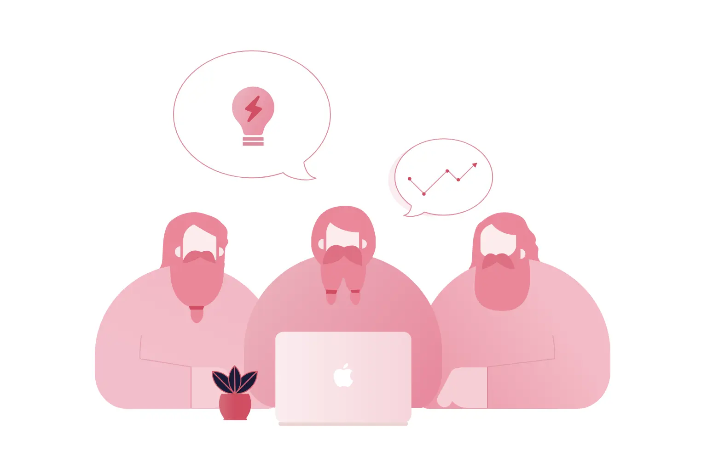

# Getting Started

## Expectation
Welcome onboard. Getting started at Dwarves Foundation can be overwhelming. Different roles have different expectation. Get to know [who does what](who-does-what.md) to warm up. There are a lot of little details, a number of big tasks, you’re learning a new job and new coworkers, and you’re likely doing all these things while working remotely. 

At the orientation meeting, we will let you know what we expect you during the probation period. Please ask your Ops buddy or your manager if the mist is covering something. Working Remote is a blessing, but it could turn out a burden. Make sure that you get the idea of [how we work](how-we-work.md) here after walking out of the Orientation meeting.

Your Dwarves buddy, your Ops buddy, and your manager are all here to help. There is no set time period for most training periods, but most people are up to speed in about 2 months.

## The first probation period
During the first probation period, your primary goals are **Ready for the job** and **get along with your peers.**

### Be ready for the job
- Your interview is a screening round for us. Every assumption we made will be pulled out for judgment.
- The first 2 weeks could be easy if everything goes well. Your performance will tell.
- The following 6 weeks might be harsh, as we love to have like-minded people around.

We’ll have a review check every 2 weeks to evaluate your progress and how you get along. Please feel free to raise up any question towards the work and the team to take the next suitable action.

### Get along with your peers
- Learn & adapt to how the team behaves through the Culture section.
- It’s essential to check out those books: Remote & Rework
- We work remotely. It could be hard to know the others. Be open on the team Campfire so people can know you better.
- We love to discuss the technology, software & design practices, also internet funny kinds of stuff.
- Small talks are okay but don’t do it always.
- Respect is earned, not given. The Dwarves admire the manager of one and who are strong in their fields.

> More on [second period](routine.md)

## Your Peers
Usually, when you start a new job in an office, it’s clear who does what. In a remote company, it’s a little less clear. Even when you know [who does what](who-does-what.md), it’s still nice to have a work buddy to ping when you don’t know where to turn. So we set up a [Fortress system](https://fort.dwarves.foundation). 

- [ ] Attend the orientation meeting
- [ ] Submit Information
- [ ] Receive [Employee Handbook](https://github.com/dwarvesf/handbook)
- [ ] Know your peers
- [ ] Know who does what
- [ ] Know how we work
- [ ] Know how we spend money
- [ ] Know your peers
- [ ] Know who does what 
- [ ] Know how we work
- [ ] Know how we spend money
- [ ] Sign up for [services](https://tools-and-systems.)
- [ ] Set up your devices
- [ ] Receive [Dwarves Handbook](https://github.com/dwarvesf/handbook)

## Setting up your machine
Before you start,  your manager will set up a Basecamp dedicated to your on-boarding called "Welcome, [your name]!". When you start, you'll have access to that Basecamp. In it, you'll see to-dos linking to accounts or services that you need to set up -- an 1Password account, 2FA for various accounts, and private wi-fi to name a few. You'll also see things that your Ops buddy or manager need to set up -- Basecamp (obvi), Email, and Gitlab, among a whole list of other things. 

**Everyone**

- [ ] Basecamp
- [ ] Email
- [ ] [Fortress](https://fort.d.foundation/)
- [ ] [Outline](https://outline.d.foundation/)

**Engineers**

- [ ] Github
- [ ] Gitlab

**Designers**

- [ ] Dribbble
- [ ] Figma
- [ ] Whimsical

## The Checklist
- [ ] Submit Information
- [ ] Read Employee Handbook
- [ ] Attend the orientation meeting
- [ ] Know your peers
- [ ] Know who does what
- [ ] Know how we work
- [ ] Know how we spend money
- [ ] Designer's Competency Map
- [ ] Sign up for services
- [ ] Set up your devices

> Next: [You are Dwarves Foundation](dwarves-foundation-is-you.md)