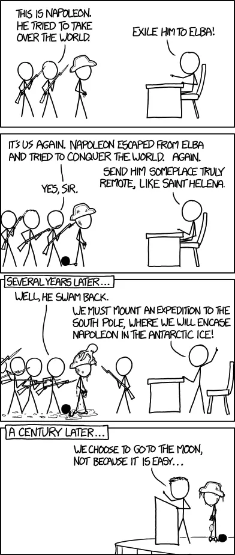

## What to expect

Welcome aboard! Starting at Dwarves Foundation mixes excitement with challenges. You're learning a new job, meeting new colleagues, and adapting to our remote culture, all at once. It's a lot to take in, but we're here to help you navigate this journey.

Different roles come with different expectations. Your first step should be getting familiar with [who does what](who-does-what.md) to understand our team structure. During your orientation, we'll clarify what we expect from you during your probation period. If anything seems unclear, don't hesitate to reach out to your Ops buddy or manager, questions are always welcome.

Working remotely is both a privilege and a responsibility. Make sure you understand [how we work](how-we-work.md) after your orientation meeting. Remember, your Dwarves buddy, Ops buddy, and manager are all ready to support you. While there's no rigid timeline for getting up to speed, most Dwarves find their rhythm within about two months.

## Getting set up

When you join, your manager will create a Basecamp space called "Welcome, [your name]!" to guide your onboarding. There, you'll find to-dos for accounts you need to set up, like 1Password and enabling 2FA for various services. You'll also see tasks assigned to your Ops buddy or manager for setting up essential tools like Basecamp, email, and GitHub access.

Your onboarding checklist includes:

- [ ] Submit your information
- [ ] Attend the orientation meeting
- [ ] Learn who does what
- [ ] Understand how we work
- [ ] Set up your devices
- [ ] Sign up for [services](tools-and-systems.md)
- [ ] Receive the Dwarves Handbook

### Essential accounts to set up

- [ ] Discord
- [ ] GitHub
- [ ] Memo
- [ ] Email
- [ ] Basecamp
- [ ] Fortress

## Your first probation period

During your first probation period, focus on two primary goals: becoming job-ready and building relationships with your teammates.

### Becoming job-ready

The interview process was just the beginning, now it's time to demonstrate your capabilities in action. Your first two weeks might feel relatively smooth as you're getting oriented. The following six weeks will be more demanding, as we challenge you to show how you think and work.

We conduct review checks every two weeks to assess your progress and how you're integrating with the team. These check-ins are your opportunity to raise questions about the work or the team, helping us adjust course if needed.

### Building team relationships

Understanding our culture is essential to working effectively with your colleagues:

- Take time to learn and adapt to how the team operates, our Culture section is a valuable resource.
- Reading Remote & Rework will give you helpful context about our working philosophy.
- Since we work remotely, being active in our team Campfire channel helps others get to know you.
- We enjoy discussions about technology, software practices, design principles, and occasionally sharing internet humor.
- Small talk is fine in moderation, but substance matters most.
- At Dwarves, respect comes from competence and self-management. We value people who are strong in their fields and can manage their own work effectively.

## Connecting with your peers

In a traditional office, it's obvious who does what. In a remote company, these boundaries can blur. Even when you understand [who does what](who-does-what.md), having a work buddy to reach out to when you're uncertain is invaluable. That's why we've established the [Fortress](https://fortress.d.foundation) system.

## Finding your purpose

Congratulations on making it through your first probation period! While clearing this milestone secures your position, truly joining our team requires something deeper, finding your purpose within our mission.

We founded Dwarves with a clear vision: to power innovation and co-create the future. We believe software will remain an essential part of that future, which is why we focus on exceptional software delivery, new tech products, and their potential impact.

Building an innovation engine where new ideas flourish requires dedicated people committed to the long game. We work tirelessly toward this goal, which is why we seek teammates who share our vision, DNA, and energy.

The most fulfilled Dwarves discover their personal purpose within our collective mission. They find meaning in crafting exceptional software, solving challenging problems, and creating tools that empower others. Those who don't connect with a sense of purpose typically don't thrive here.

As you move forward, ask yourself: How does your work contribute to our shared vision? What impact do you want to make? Where do your talents and passions intersect with our goals? Finding these answers transforms a job into a calling.

---

> Next: [You are Dwarves Foundation](dwarves-foundation-is-you.md)
