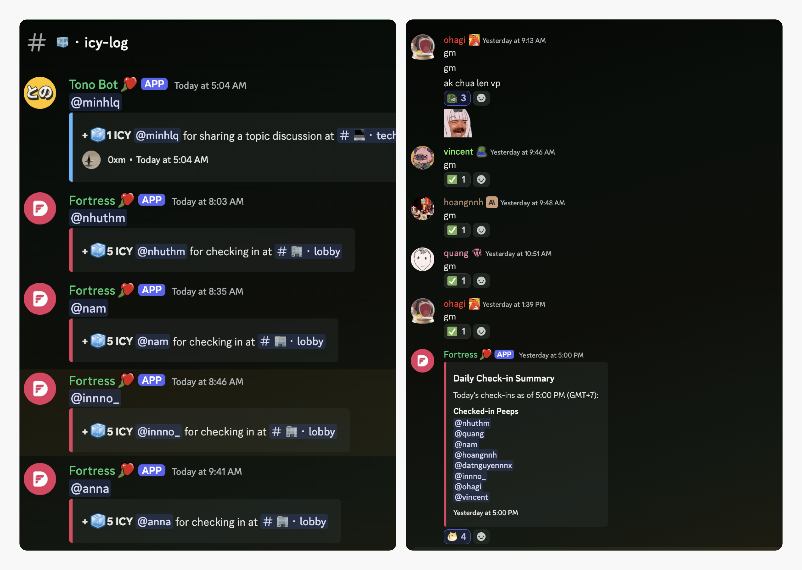

Remote work is great, but there's something about the in-person vibe that helps us learn, share, and connect. To make the most of our hybrid style, we’ve set up an easy check-in process to reward those who pop by the office.

## Arriving at the office

Find your spot and get comfortable. Our office is set up for focus and creativity, so you’ll find a space that works for you.

## Connecting to the office wi-fi

Once you’re settled, make sure to connect to the office Wi-Fi. This keeps you linked to our system and ensures you’re ready to check in.

## Getting on Discord

Open Discord on your device and make sure you’re logged into the Dwarves server. If you haven’t joined yet, now’s the time.

## Checking-in

Head over to **🏢・lobby** channel. Type "gm" (short for "good morning") and hit send. That’s it—you’re officially checked in for the day.

## Earning your ICY tokens

After your "gm" message, our system will credit you with 5 ICY tokens, worth about $7.5. It’s our way of saying thanks for being here and joining the in-person energy.

## Making the most of your time

You’re all set. Now’s your chance to catch up with teammates, share ideas, or just enjoy the office vibe. These face-to-face moments make all the difference.

