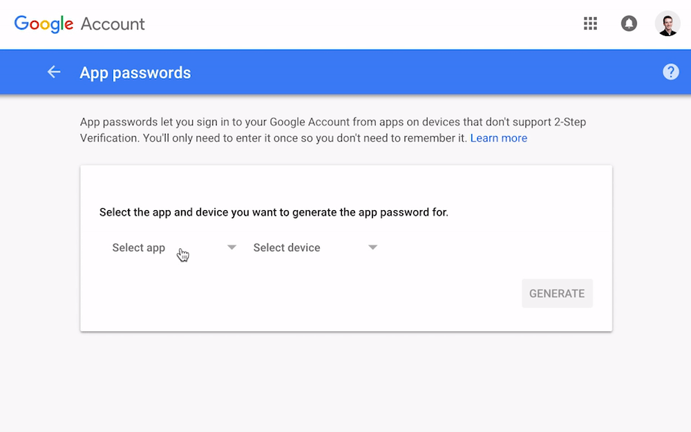
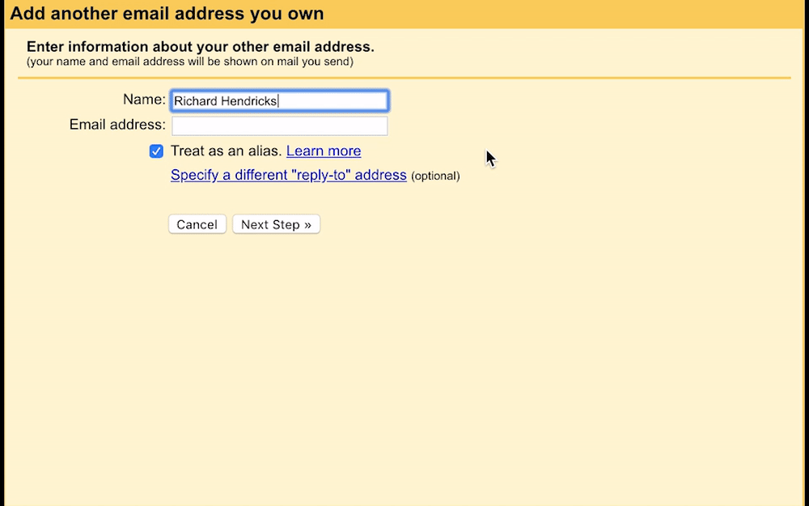
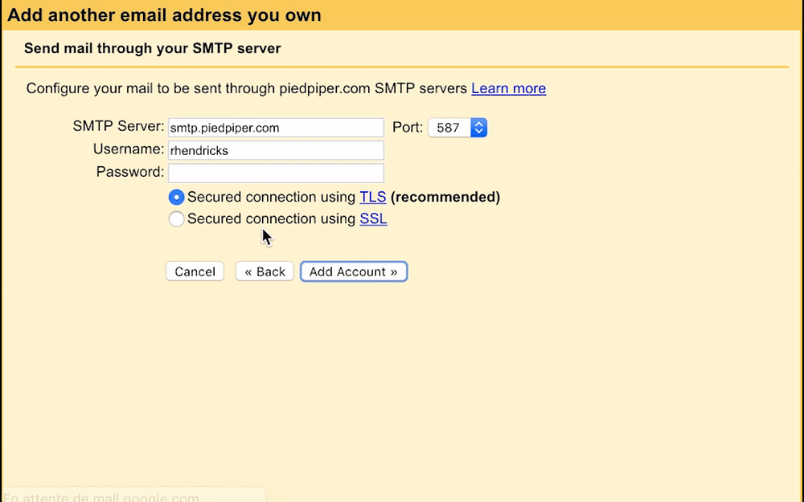
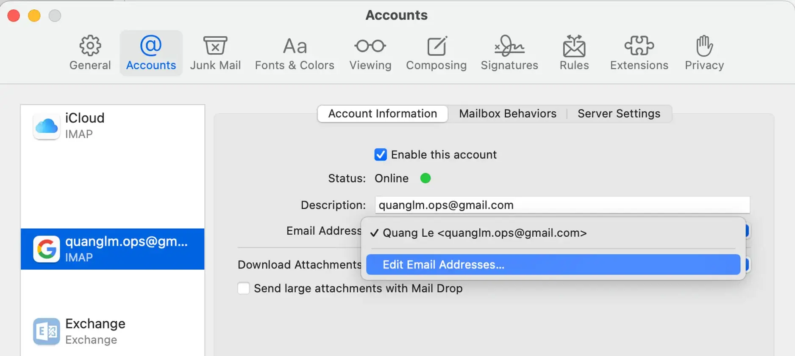
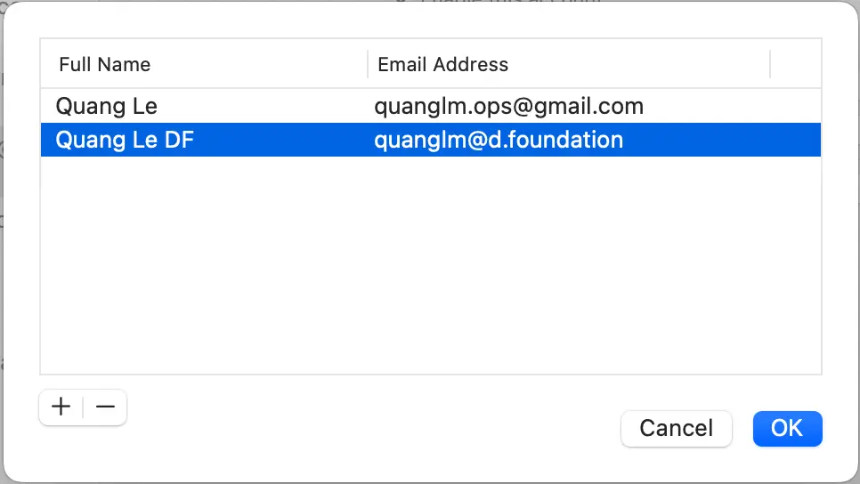
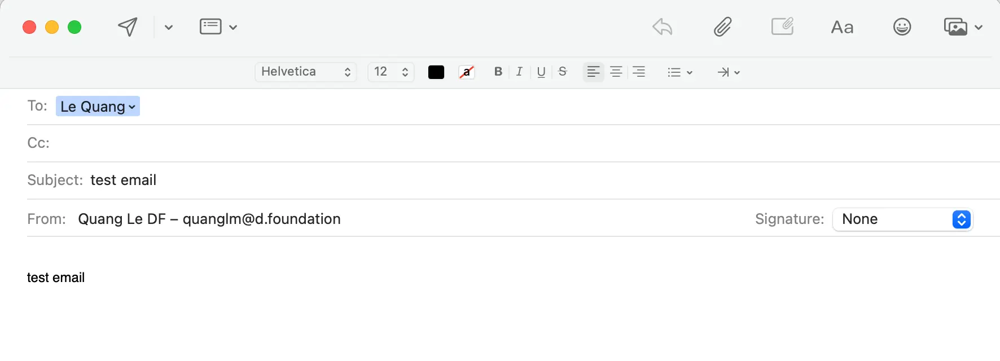

If you are using a team email alias and want to send emails from that address using your personal Gmail account, this guide shows you how to set it up. This allows you to manage communications for the alias without leaving your main inbox.

## 1. Enable 2FA (if you haven't already)

First things first: **You need two-factor authentication (2FA) enabled** on your personal Google account for this setup to work.

- If you already have 2FA set up, great! You can skip to the next step.
- If not, head over to Google's 2FA setup page and enable it now:
  [https://www.google.com/landing/2step/](https://www.google.com/landing/2step/)

## 2. Create an app password

Next, you'll create a special password that lets Gmail access your account securely for sending mail.

1. Go to your Google Account's [App Passwords](https://security.google.com/settings/security/apppasswords) page.
2. Under "Select app," choose **Mail**.
3. Under "Select device," choose **Mac** (even if you're on Windows/Linux, this works).
4. Click **Generate**.
5. Google will show you a 16-character password. **Copy this password now** and keep it somewhere safe temporarily. You'll need it in step 5.

## 3. Add your company email address to Gmail

Now, let's tell Gmail about your `@d.foundation` address.

1. Open your personal **Gmail**.
2. Go to **Settings** (click the gear icon ⚙️) -> **See all settings**.
3. Click the **Accounts and Import** tab.
4. In the "Send mail as" section, click **Add another email address**.

## 4. Enter sender details

A popup window will appear.

1. **Name:** Enter the name you want recipients to see (e.g., "Your Name").
2. **Email address:** Enter your full company email address (e.g., `your.name@d.foundation`).
3. **IMPORTANT:** **Uncheck** the box labeled "Treat as an alias".
4. Click **Next Step »**.

## 5. Configure the SMTP server

This step tells Gmail how to send emails using Google's servers.

1. **SMTP server:** Enter `smtp.gmail.com`.
2. **Port:** Keep the default (usually 587 for TLS).
3. **Username:** Enter your **full personal Gmail address** (e.g., `your.personal.email@gmail.com`).
4. **Password:** Paste the **16-character App Password** you generated in Step 2.
5. Leave **Secured connection using TLS** selected.
6. Click **Add Account »**.

## 6. Confirm ownership

Gmail needs to verify you own the `@d.foundation` address.

1. Check your **personal Gmail inbox**. You'll receive an email from Gmail with a confirmation code.
2. Copy the code from the email.
3. Paste the code into the popup window and click **Verify**.

## 7. Send emails from your alias

You're all set! Now when you compose a new email in Gmail, you'll see a "From" dropdown menu. You can select your `@d.foundation` address to send from that alias.

- **Tip:** In Gmail's "Accounts and Import" settings, you can choose whether to default to replying from the same address the message was sent to, or always reply from your default (personal) address.

## 8. Send from Mac Mail (Optional)

If you use the Mail app on macOS and want to send from your alias there:

1. Open the **Mail** app.
2. Go to **Mail** -> **Settings...** (or **Preferences...** on older macOS).
3. Click the **Accounts** tab.
4. Select your personal Gmail account from the list on the left.
5. Click the **Server Settings** tab (or similar, depending on macOS version).
6. In the "Outgoing Mail Account" (SMTP) section, you might need to edit the server list or add the alias directly. _Alternatively, and often simpler:_ Click the **Account Information** tab.
7. Find the **Email Address** dropdown menu and click **Edit Email Addresses...**.
8. Click the **+** button.
9. Enter your **Name** and your full `@d.foundation` **Email Address**.
10. Click **OK**.

Now, when composing a new message in Mac Mail, you can select your `@d.foundation` alias from the "From" dropdown.

