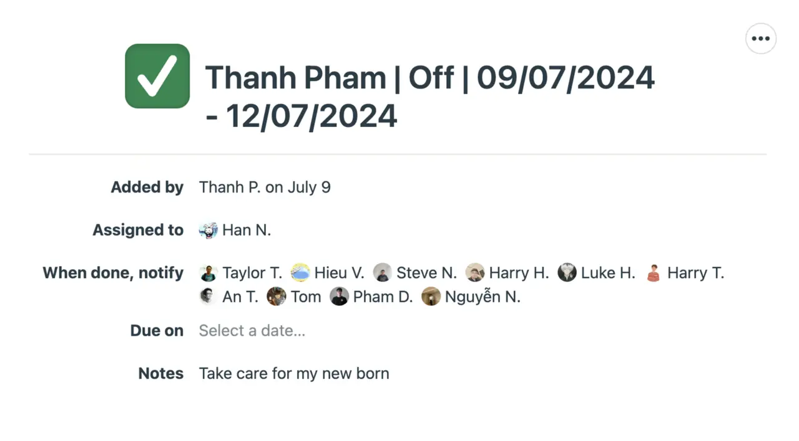

To keep everything running smoothly, it’s important that we all follow a clear process when requesting leave. Whether you’re planning a half-shift or a full day off, we want to make sure your absence doesn’t disrupt the team or the project.

By following these steps, you help ensure that everyone is on the same page and that your work is covered while you're away:

### Before request submission

Discuss your leave with the client and team in advance to align tasks and minimize the impact on the project.

### How to submit request

- Log in to Basecamp.
- Create a ticket in the Woodland channel > On-Leave Request list.
- Use the format: Name | Type of absence (off/remote) | Date | Shift (if any).
- Assign to: Project Manager, Account Manager, and Project Lead.
- Timing:
  - **Urgent**: Immediate
  - **Non-urgent**: 2x absence duration
  - **Holiday**: 1-2 weeks in advance

For example, if Thanh Pham plans to have his day off on both Jul 9th to 12th, the request must be submitted 8 days in advance, on Jul 1st. If Thanh Pham's mentor is Han Ngo, the request should be formatted as follows:

### Verification & notification

After submitting the request, the line manager and leader will discuss the request with you. They will work with you to align the workload and resources to ensure the project remains on track. A working process will be designed to prevent any interruptions during your absence.

### Approval/denial

If your request is approved, the manager will mark the ticket as done and note your return date. Basecamp will send an approval email to everyone involved, and the Google Calendar will be updated.

Since the client doesn't receive Basecamp notifications, you or the manager must inform the client via email. If denied, the manager or lead will note the reason in the ticket.

### Announcement

Once your request is approved, a short informal message should be delivered to the related team channel to notify other team members. On the client side, you must announce your leave to the client’s communication channel and remind them before the leave.

### Holiday notifications

1-2 weeks before the holiday starts, Operations will send an official email announcement to all clients about the holiday period. Then, 2-3 days before the holiday begins, your Project Manager or Leader will remind clients informally via Slack or other communication channels.

**Note**: During holidays or days off, unless stated as URGENT, we should NOT respond to clients on that day.

