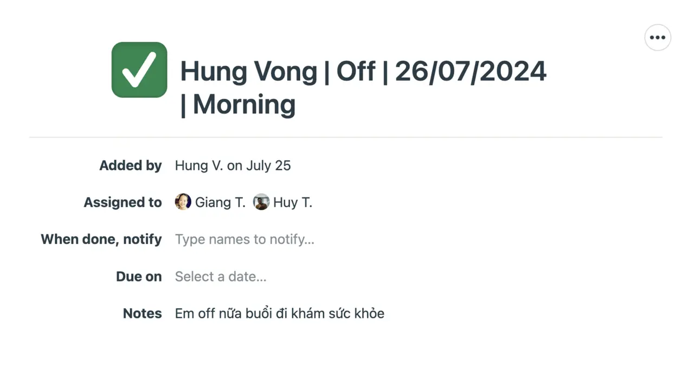
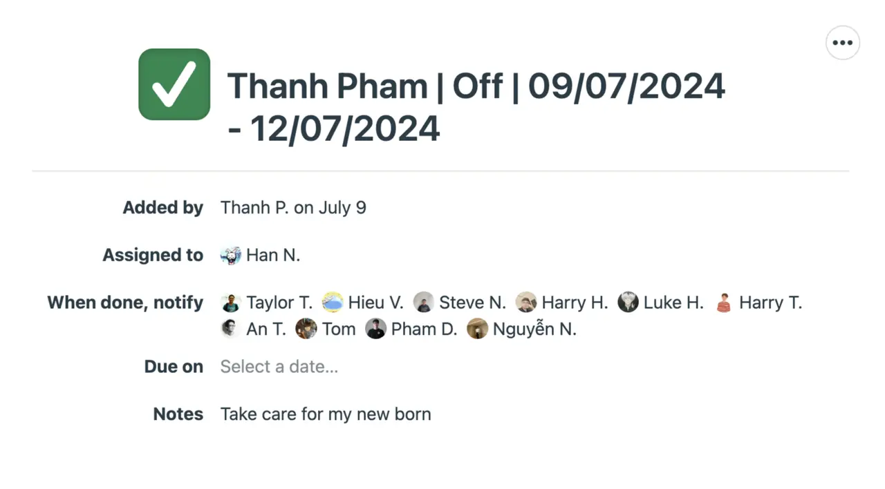

A consistent on leave process prevents a company from being accidentally disrupted when an employee request to be absent. 

At our woodland, every time an employee submit a request for on leave or remote work, whether it is for half-shift or all day absence, the process shall be required to follow these following steps:

### Before request submission
Employee needs to discuss with the client and the team ahead to align tasks so their absence affect project as little as possible. 

### Request submission
We segment the request based on the urgency of the request. 
- Urgent request: Notify project manager, account manager and project lead immediately.
- Not urgent request: You need to notify double the time of absence 
- Holiday requeset: This request need to notify 1 to 2 week ahead.

For every request, employee must log in on the company's Basecamp channel and create a ticket on **On-leave Request** list and assign the ticket to project manager, account manager and project lead, with the detailed format as below:

For example, if engineer Khiem Vo is planning to have his day off on both Jan 4th and Jan 5th, the request must be submitted 4 days in advance, which is Jan 1st. And the mentor of Khiem Vo is Huy Nguyen. The request should be:

### Notify and verification
The mentor should notify Project Manager by email and cc Operation Department for their counsel of approval. 
In case the responsibility of this employee is involved in any project, a contingency strategy should be applied in order to prevent the working process from being interrupted or blocked. 

### Approval/ Denial
After the approval/ denial decision has been made, Basecamp will inform the employee with an email of approval, along with a Google Calendar schedule. 

The manager will also mark done on the ticket which was assigned to him previously, and note down the employee's return date (if the request is approved) or the reason (if the request is denied)

### Announcement
An email of announcement should be sent from the mentor to the employee, Project Manager and Operation for confirmation. In addition, a short message can be delivered informally to the related-team channel to notify other team members. 

At the client side, employee must annouce to clients via email or communication channel. 

### Holiday
1-2 weeks before holiday starts, Operation will send official announcement via email to all clients about the holiday period. After that 2-3 days before holiday starts, Project Manager or Leader of the project need to remind clients again informally via Slack or other communication channels of that project.

Note: During Holiday day or day off, unless it's stated as URGENT, we should NOT response to client on that day 
