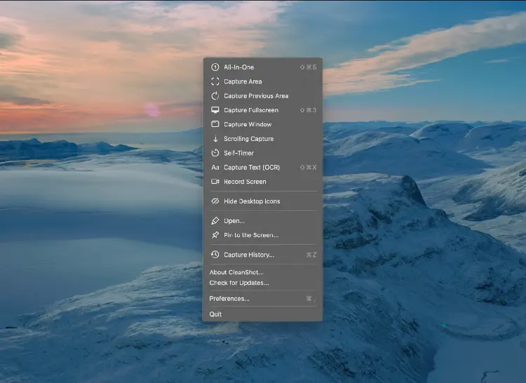

I grab screenshots pretty often. Although macOS’s native screenshot tool is decent for most cases, it’s still a very basic one. Here are a few tips on how to take great-looking screenshots with a simple tool and in less time.

## Installation and Setup

CleanShot X is actually an app I downloaded as part of my Setapp subscription. I use CleanShot every single day. The app offers a wide range of features, from capturing screenshots and recording your screen to annotating and quick editing.

1. Sign up subscription on Setapp
2. Download and install CleanShot X
3. Once installed, the app is going to ask if you want CleanShot to be your default screenshot tool.
4. You will find various commands under the CleanShot X Extension by clicking the CleanShot shortcut in the Control Center.

## Using CleanShot X

### **Added keyboard shortcuts to Quick Access Overlay**

You can spend time figuring out what workflow and keyboard shortcuts are best for you. Open settings, here’s what I found works best for my setup.

- `Command Shift 4`: capturse an area / a part of the screen
- `Command Shift 3`: captures full screen
- `Command Shift 5`: captures all-in-one
- `Command Shift 5`: captures window
- `⌘C`: Copy to clipboard
- `⌘S`: Save
- `⌘W`: Close
- `⌘U`: Upload to Cloud
- `⌘E`: Open annotation tool

CleanShot is highly customizable, you can adjust nearly every behavior and tweak settings for your needs.

### **Annotation and Editing Tools**

- **Annotate**: Annotate your screenshots with various tools. Highlight or hide specific parts of your screenshots, crop, and add necessary annotations.

- **Background Tool in Annotate:** easily create beautiful social media posts that stand out from others. You can even change the padding, shadow, alignment, and border-radius of your screenshot. The Auto Balance option will make your screenshot look perfectly aligned by adjusting the space around the content.

- **Using Dwarves color scheme in Background Tool:** when editing your cropped screenshot in Cleanshot, you have the option to place it on a blank canvas or use Dwarves’ branding color scheme. It's also possible to easily customize the screenshot.

  1. **Customization at Pain Color:** choose a custom color using the RGB sliders then enter a Hex code **`F8F8F8`**.
  2. **Dwarves' Branding Scheme:** Set Dwarves' branding colors as the background wallpaper (if different from Pain Color).
  3. **Alignment:** center your screenshot on the canvas for a balanced look.
  4. **Padding:** adjust the padding to 76 for optimal spacing around your content.
  5. **Shadow:** apply a shadow effect with a strength of 28 to enhance the depth of your screenshot.
  6. **Dwarves Logo:** add the Dwarves logo in the top left corner

### **Screen Capture Features**

- **Scrolling capture**: refers to taking a screenshot of a webpage while scrolling down. Select the Scrolling screenshot, start scrolling slowly, or use auto-scrolling.
  This feature is used when using VSCode to write articles/publications and will submit screenshots to the manager for feedback on both content and visual.

- **Capture Text (OCR)**: use OCR to capture text from your screen. Simply select an area that contains the text, and it will be copied to your clipboard.

- **All-In-One mode**: this mode allows you to specify the size and lock the aspect ratio for your screenshots. It also saves your last selection, making it easier to retake your last screenshot.

- **Recording Features**: choose between recording a video or a GIF, whether to capture a specific window, custom dimensions, a part of the screen, or fullscreen. With our built-in video editor, you will be able to prepare a screen recording for sharing, by reducing its file size or changing the audio settings.

- **Open History**: access your screenshot history. You can remove files from the Capture History or restore recent captures if you ever need them again.

## Overall

This guide will help you quickly make great screenshots with this tool. It does exactly what we need it to do, and I think you'll love it, too. Keep practicing with these tools, they're like the cherry on top, adding that extra something to your work.

