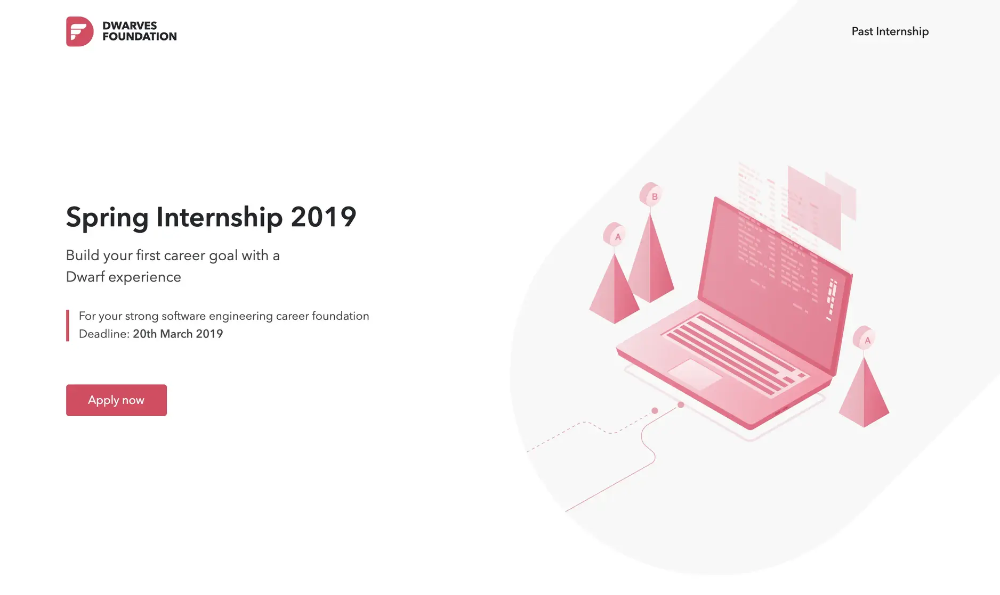

## Why we hire the way we do

Hiring at Dwarves means we need help, but not just any help, we need the right help. We're looking for teammates who will grow with us for the long term, which is why we place such high importance on finding people who align with our values and culture.

We don't hire people to tell them what to do. Instead, we hire people who can tell us what to do. This distinction is crucial. We want independent thinkers who can shape their work and contribute to our direction, not just follow orders. This approach helps us maintain our creative culture and build a team of engaged, motivated professionals.

## Our hiring goals

We seek teammates who embody our core personas: independence, teamwork, problem-solving mindset, and determination. These qualities aren't just nice-to-haves, they're essential to how we function as a team.

Independence means you can drive your own work. Teamwork means you can collaborate effectively. A problem-solving mindset means you approach challenges creatively. And determination means you persist through difficulties. When we find people who demonstrate these qualities, we know we've found someone who can thrive with us.

## We hire managers of one

What does "manager of one" mean? It's someone who sets their own goals and executes them without needing constant direction. They don't require daily check-ins or extensive oversight. They essentially do what a manager would do, establish priorities, determine what needs to get done, and follow through, but they do it for themselves.

These self-directed people free the team from excessive supervision. When left to their own devices, they surprise you with their productivity and initiative. They need minimal handholding because they naturally take ownership of their work.

How do we identify these people? We look at their history. Have they shown self-sufficiency in previous roles? Have they defined their own path? Have they started a project, company, or initiative from scratch? We look for evidence of initiative and entrepreneurial spirit, then nurture those qualities.

We want teammates capable of building something from nothing and seeing it through to completion. Finding these people allows our team to focus more on creating and less on managing.

## Our hiring process

We've designed a thoughtful process to identify the right teammates. Several Dwarves participate in each hiring decision, walking candidates through five distinct stages:

### CV screening

We start by evaluating your resume and checking references to understand your background and whether you might be a personality fit. Based on our current team composition, we'll decide whether to proceed to the next stage.

### Pre-assessment

For Fresher and Junior positions, we conduct a 30-minute online test to evaluate logical thinking, English proficiency, and personality traits.

### Assignment

This stage assesses your skills and problem-solving approach through practical work. It gives us both an opportunity to discuss work-related topics in depth and see how you approach real challenges.

### Interview

During our 90-minute interview, you'll learn about our working style and philosophy, while we learn about your background and skills. After this conversation, you'll meet with our Technical Recruiter to discuss the benefits package and clarify expectations from both sides.

### Roadmap design

Once you've passed the technical assessment, we'll walk you through our vision and long-term plans. This helps ensure we're aligned for the future and creates a foundation for your experience with Dwarves Foundation.

## Alternative entry paths

We offer two additional programs that run twice yearly in Spring and Summer:

**The Internship**: A 3-month program for students from top universities, with or without engineering backgrounds.

**The Apprenticeship**: A 6-month paid career development program designed for people from underrepresented groups in tech who have non-traditional technical backgrounds.

These programs give candidates real-world project experience, no coffee runs. We enjoy watching talented people explore and develop their skills in a supportive environment.

## Our referral program

We maintain our quality standards by encouraging Dwarves to recommend friends who would be a good match for our team. Your suggestions are valuable because you know both the person and our culture.

We prefer to reward you rather than pay external recruiters. When your referral successfully joins as a full-time team member and gets assigned to a project, you'll receive 2% of the project service fee. This bonus is paid when the client completes the project invoice, provided you're still with the company.

Here's a simple example:

- You refer your friend to Dwarves Foundation
- Your friend works on a project with a monthly service fee of $5,000
- Each time the client pays their monthly invoice, you receive a referral bonus of $100

This approach helps us find great people through our trusted network while rewarding team members who help us grow.
