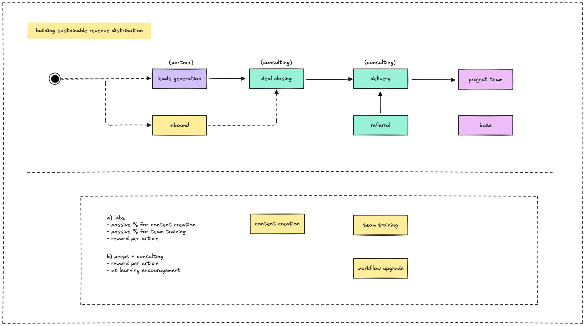

We do the business to provide engineering capabilities to help customers on their business. A part of the benefits package is the Stock Option Plan, and the money is the sensitive topic in most companies, but we want you to understand so you could commit your best to make Dwarves Foundation a right place to work.

Besides the paycheck that we agreed on the employment contract, the revenue split into a various portion

- Commission is the bonus amount of 10% for the partners, marcomms, and consulting team, who help to bring the deal to the table.
- Payroll fund is the amount of 60% to reserve, cover the payroll and taxes for everyone in the company including dev, design, ops, growth, and management.
- Operation expense is the amount of 20%, and it consists of the cost for office space, facilities, events, sideway program, hiring, and training. That's also include the passive portion for labs team, who continuously contribute to our inbound engine.
- The last portion is the profit with the estimation of 10% before taxes which 5% of that will be turned into dividend payment at the end of the year.

That’s it. Read more about the [Stock Option Plan](stock-option-plan.md)

