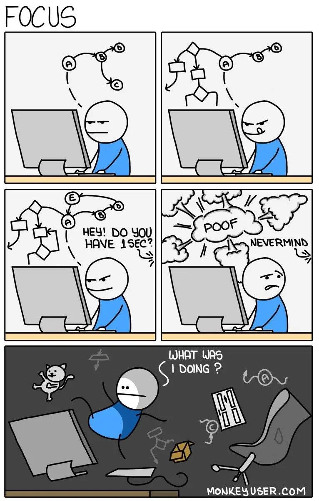

## Our approach to work

Before joining us, you likely discovered a bit about how we operate as a team. This section expands on that foundation, highlighting the key aspects of our work philosophy without repeating information available elsewhere.

## Embracing agile principles

We build software through collaboration among team members who understand the domain and project vision. This shared understanding helps us adapt quickly to market changes. We embrace agile philosophy at its core, focusing on the principles rather than rigid practices.

The Scrum framework fits us well. When starting a project, we don't assign specific roles. Each team member has both autonomy and responsibility to meet sprint goals. The Scrum master emerges naturally from within the team as a coach who removes obstacles. This role is temporary; a mature team eventually outgrows the need for a permanent coach.

## Our 8-week cycles

We organize our work in 8-week cycles, typically running six cycles per year. This fixed timeframe creates a healthy sense of urgency, prevents scope creep, and provides regular intervals to reassess priorities.

The goal isn't to fit everything within eight weeks. Rather, we break larger projects into manageable chunks that can be completed in this timeframe. We bundle smaller tasks into cohesive work packages that can be clearly discussed and evaluated.

Think of time constraints as a budget that focuses our conversations about what's reasonable. When a project starts slipping, we first look to reduce scope rather than extend hours. Most of our work can be successfully structured within these eight-week boundaries.

## Cooldown periods

Between cycles, we take a week to cool down. This is when we address backlogs, fix bugs, document completed work, and plan our next priorities. It's tempting to use this time to extend the previous cycle, but we resist that impulse.

We treat the end of a normal cycle as "pencils down" time. By week 4, we should be winding down, preparing to launch, arranging quality assurance, and handling other post-launch activities.

## Meeting structure

All our scheduled meetings appear on Basecamp. Here are the key gatherings that structure our work:

### All-hands meetings

We hold all-hands meetings at the end of each cycle. The entire team reviews what we've accomplished and determines our next priorities.

### Team meetings

You'll belong to one of our functional teams: Programming, Design, Operations, or Business. Each team meets on the last Friday of the month. Team leads may adjust meeting frequency based on specific needs.

### Project meetings

Each project follows its own meeting schedule, aligned with our cycle and Scrum framework. At minimum, each project includes Sprint Planning and Sprint Retrospective meetings.

## Communication approach

Following every activity in Basecamp can be overwhelming and unproductive. Instead, we've developed four primary ways to keep everyone informed:

1. **Daily updates**: The "What did you work on today?" question provides detailed, personal narratives about ongoing work. These updates spark conversations about topics you care about or want to learn from. While not required daily, please respond at least twice weekly when you're working.

2. **Weekly intentions**: The "What will you be working on this week?" question outlines your plans for the coming week. Everyone should answer this when they're not out of office.

3. **Heartbeats**: These team summaries answer "What did you work on this cycle?" They celebrate accomplishments and synthesize completed work. Team leads write or assign someone to write these summaries one week after a cycle ends.

4. **Kickoffs**: These team plans address "What are you going to work on next cycle?" They outline the coming eight weeks of work. Team leads write or assign someone to write these before each new cycle begins.

These communication practices allow individuals and teams to work with confidence and independence. We have six major decision points yearly to determine priorities, with the remaining time focused on execution. Clear communication expectations build trust in our direction and process.

## Pitching ideas

Everyone can help shape what we work on, regardless of their role. The way to influence our direction is through pitches.

Develop your idea for a new feature, workflow improvement, or any product development as a detailed post. The more specific, the better. This gives everyone a chance to consider and respond. Having your idea captured in writing means it's available for reference anytime.

We always have more pitches than we can pursue, so maintain realistic expectations about what happens after you share yours. At minimum, everyone involved in product development will read and consider your pitch. That alone is valuable. Even if your complete idea isn't implemented, it may influence other decisions by highlighting areas needing attention.

Han evaluates pitches for inclusion in upcoming cycles before each cycle begins.

## Raising concerns

Occasionally, team members may have concerns about colleagues, clients, leadership, or the work environment. We want everyone to feel empowered to raise issues and have them addressed promptly and fairly.

Here's how to approach concerns:

1. **Direct conversation**: If you feel comfortable, speak directly with the person involved. We encourage this direct, informal approach and expect colleagues to respond constructively. This works particularly well for communication issues where someone may not realize their behavior is causing distress.

2. **Ask for intervention**: If direct conversation isn't appropriate, ask a colleague or leader to intervene informally on your behalf. This is especially helpful when you're uncomfortable approaching someone directly.

If you have concerns about a leader and don't feel comfortable raising them directly, speak with another leader or ask a colleague to raise the issue for you.

If these approaches don't resolve the issue, please speak with Han.

## Our check-in approach

"Seen any good movies lately?" "What's something that inspired you recently?" "Found any new recipes worth trying?" Our check-in questions vary widely and are meant to foster natural connection.

Don't feel obligated to answer every question we pose. None of us do. We prefer organic engagement, so don't be surprised if you see a question without immediate responses, or responses appearing out of sequence. That's perfectly normal and part of our authentic communication style.

## Valuing self-management

At Dwarves, management is a part-time role that complements hands-on work. We rely heavily on each person's ability to self-manage. Those who excel at this become what we call "managers of one," and we aim for everyone at senior level or above to embody this quality.

What does being a manager of one mean in practice? It means setting your own direction when none is given. It means identifying what needs to be done and doing it without waiting for instructions. When left to their own devices, effective self-managers use their time productively. There's always more work to tackle, more initiatives to launch, more improvements to make.

## Remote-first approach

We deeply value work-life balance and have embraced remote work as our primary operating model. This approach is optional but highly recommended.

Why? Happy people deliver significantly better results. Creativity suffers when you're confined to the same space day after day. We believe everyone should control their time and work environment as long as they uphold our company values.

We don't want to manage your physical presence. We want our team to have the freedom to wake up at the beach, grab coffee, and start doing work they love. Or to spend the day in a downtown café for social interaction. Or to breathe fresh air in Da Lat or Chiang Mai, or create a cozy workspace at home with their children nearby.

With this freedom comes substantial responsibility. Our remote culture works because we trust each team member to deliver the technical expertise our clients expect.

## Project onboarding

We work on diverse projects at Dwarves. During onboarding, we ensure new team members understand the project type, whether it's a [Ventures](https://dwarves.ventures/) project, Corporate Social Responsibility (CSR) initiative, or typical Tech Partner engagement.

Each project type carries specific expectations regarding milestone understanding, deliverables, and quality standards. We take craftsmanship seriously, encouraging everyone to take pride in every line of code and every deliverable they produce.

## Our craftsmanship philosophy

Software Craftsmanship represents our commitment to responsibility, professionalism, pragmatism, and pride in software development.

While craftsmanship alone doesn't guarantee a project's success, its absence is often the primary cause of failure. We strive to embody this philosophy in everything we build.

---

> Next: [Work routine](routine.md)

