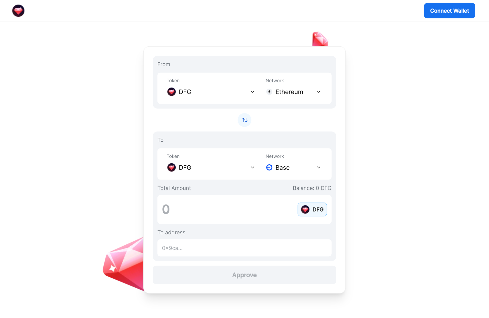
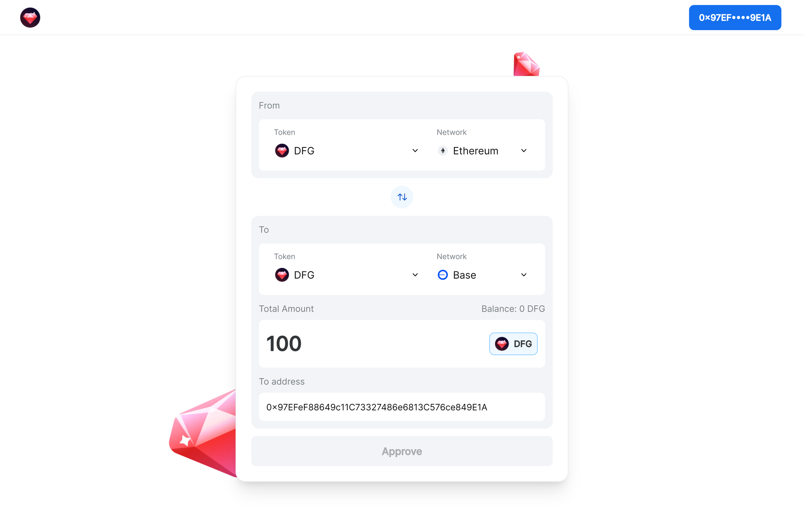
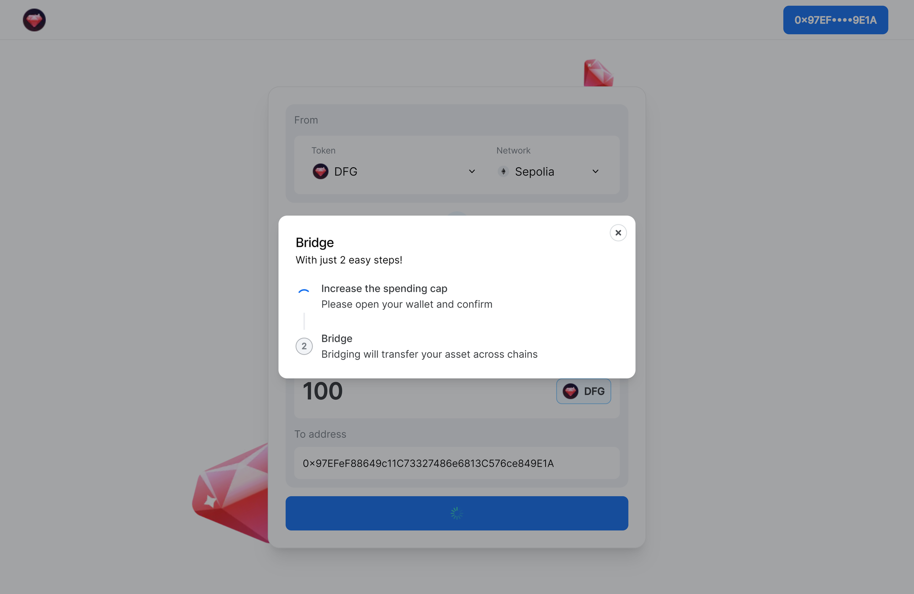
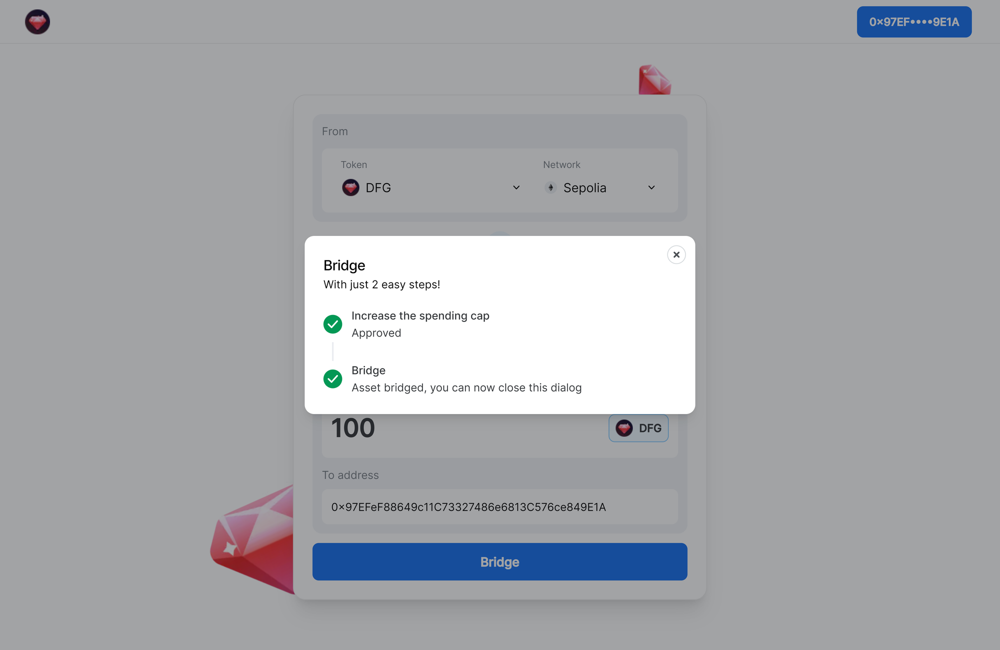

$DFG is a token that represents the shares of Dwarves Foundation for Dwarves and active contributors of our communitiy. Dwarves team introduced a [program](stake-dfg-and-earn.md) to help $DFG holders earn $USDC from staking $DFG on Base. However, the orgin $DFG is on Ethereum Network, which means to stake $DFG and earn reward, $DFG holders need to move $DFG from Ethereum to Base using a bridge.

Before going to the bridging part, please make sure that you have completed these steps:

- Use Coinbase [wallet](setup-crypto-wallet.md) to store your tokens.
- Get ETH to transfer $DFG from Ethereum to Base with [Binance P2P](https://www.binance.com/en/blog/p2p/binance-p2p-newbie-guide-7428324997079645557).
- [Withdraw](https://www.binance.com/en/support/faq/how-to-withdraw-crypto-from-binance-115003670492) ETH from Binance to your Coinbase wallet.

## How to transfer

Once you've got Coinbase Wallet set up and some ETH in the tank for gas fees, it's time to bridge your $DFG over to Base for staking.

Here is how it goes:

1. Head on over to [DFG Bridge](https://bridge.d.foundation/), lovingly crafted by Jack, one of our awesome community members. Connect your wallet to the site.

2. Once your wallet is connected, your address will show up in the blue box, fill out these:

- In the "From" tab, select "DFG" for Token and "Ethereum" for Network.
- In the "To" tab, choose "DFG" for Token and "Base" for Network.
- Enter the amount you want to send.
- The address on the Base network should be your connected wallet by default.

3. Once you've filled in those blanks, hit Approve, and confirm a couple of transactions on Coinbase Wallet.

- **Spending Cap**: The spending cap limits how much cryptocurrency you can spend at once or over time.
- **Approval**: Each transaction must be approved to ensure awareness and consent, enhancing security and preventing unauthorized or accidental transactions.

4. Then just sit back and wait for your DFG to roll into your Base wallet.
   
