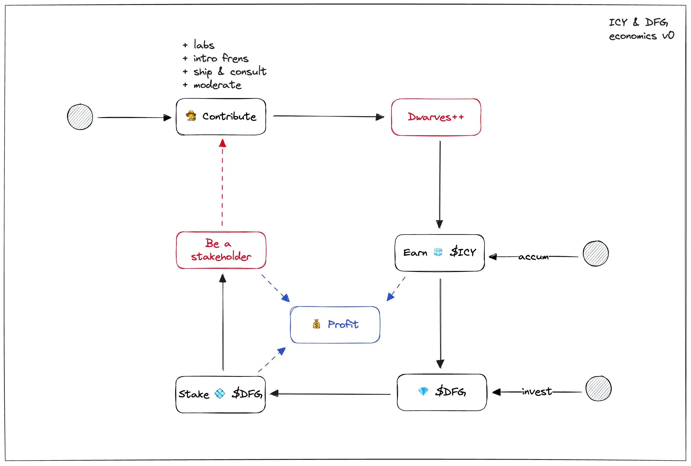
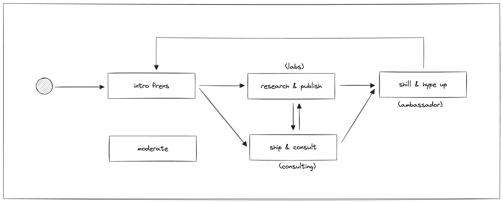

Here's our draft internal map/v0 for 🧊 $icy play, based on our current activities at this borderless software firm.

Back in 2018, when i envisioned doing something unconventional with our setup, we introduced 💎 \$dfg. It came with a dream that everyone on the team can help build next generation software, stay cool making money and own something. I planned to step down and give more ownership to those who actually implement our projects by gradually distributing $dfg to our grind chads.

In 2020, we intro 🧊 $icy as a loyalty point system, so we can use it to tip/recognize others and encourage the culture of appreciation.

Now in 2023, the thing we are doing is so called building a protocol with its economics. There are more concept like proposal, voting, automated workflow will be introduced sooner or later. Hopefully the Dwarves brand could continue to thrive and we will all benefit from it.

Enjoy the play 💻
