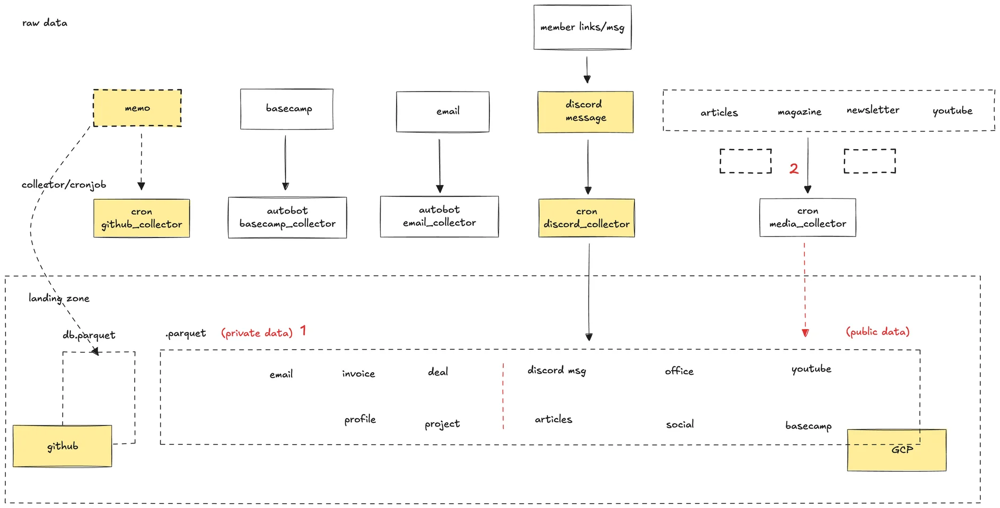

## What is this knowledge base thing?

Basically, think of the knowledge base as our team's shared memory, or a "second brain." It's the main spot where we keep all the info and notes we need for our work. We made this so we can work together better, make smarter choices, and stop repeating the same work. It's just our record of how we do things and what we learn along the way.

## What kind of stuff is in here?

It holds two kinds of info:

1. **Private stuff:** This is our internal info, like team details, notes on projects, client info, sales leads, money stuff, and reports. We keep this private because it's important for running the company day-to-day.
2. **Public stuff:** We also collect useful info that's out there for anyone to see. This could be about what's happening in our field, new tech, who's hiring, interesting articles, or what competitors are up to. Looking at this helps us see the bigger picture and spot chances.

Also, important chats and decisions from **Basecamp** and **Discord** get added here too, so good ideas don't get lost.

## How do we actually use it?

It's not just a pile of files; it helps us work smarter. We build tools using this info so you can easily:

- Find answers about how we do things or company policies.
- Look up past projects or check reports.
- See what's new in our industry.

Think of it like this: it's our team's collective know-how. As we keep working and learning, this place grows with us. It shows we're serious about getting better at what we do.

## Keeping it useful

Making sure this knowledge base stays useful takes work. The core team looks after how it's organized and kept up, trying to keep things simple. But it really works best when everyone chips in. We hope you'll add to it, fix things that are out of date, and share ideas to make it better. Keeping our shared brain sharp is something we all do together, showing we care about doing good work.
