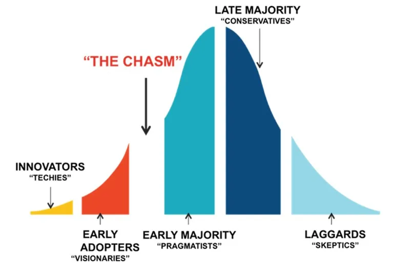
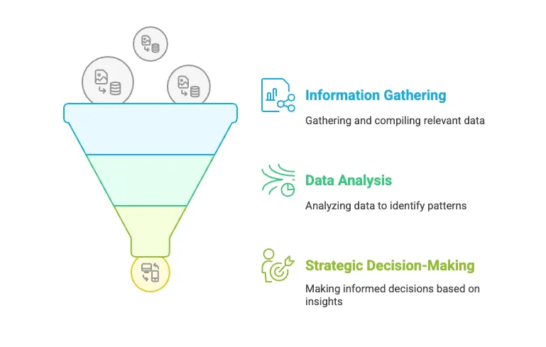

You've probably noticed that technology changes frequently. Right now, AI is a major wave, but before that, we saw big shifts with DevOps, mobile, and the cloud. Each significant change brings new tools and changes what clients need.

For a consulting company like us, just being good at using today's tools isn't enough. A key challenge is understanding and adapting to these ongoing technology changes. Clients come to us because they trust our knowledge. They expect us to be skilled with current technologies and also to have some awareness of what might be coming next. Technology doesn't stand still. If we fall behind, we become less useful and less competitive.

To stay relevant, we need to look ahead and have a process for adapting. This means knowing about new trends is important for our business. It helps us figure out which new technologies might be useful, how they could affect our clients, and what skills our team needs.

### How we try to adapt

At Dwarves, we define our own pattern for dealing with these changes:

1. **Gathering information**: We pay attention to what's happening in the industry (like news and market trends) and also look at what we learn from our own projects and discussions. This helps us spot new technological developments.
2. **Understanding data**: We take this information and analyze it. We look for patterns and try to understand what these changes might mean for us and our clients. The goal is to turn general information into useful insights for making decisions.
3. **Making decisions**: These insights help us decide how to prepare. We identify relevant trends, choose which new technologies to focus on, train our current team, and hire people with the right skills for the future.

### Using tools to help

We’ve built some internal software to support this process. These tools help us collect information, make sense of it, and decide which technologies to adopt. The aim is to have a consistent way to manage technology changes so we can operate predictably and grow, while still being able to react when things shift unexpectedly.

### Your role in this

Understanding how we approach technology changes is helpful for everyone here. When you share relevant information, help organize what we know, or suggest improvements to our process, you're contributing to our ability to adapt. It shows you understand not just your daily work, but also why keeping up with technology is important for the company's future. Your involvement helps us all stay prepared for what comes next.
