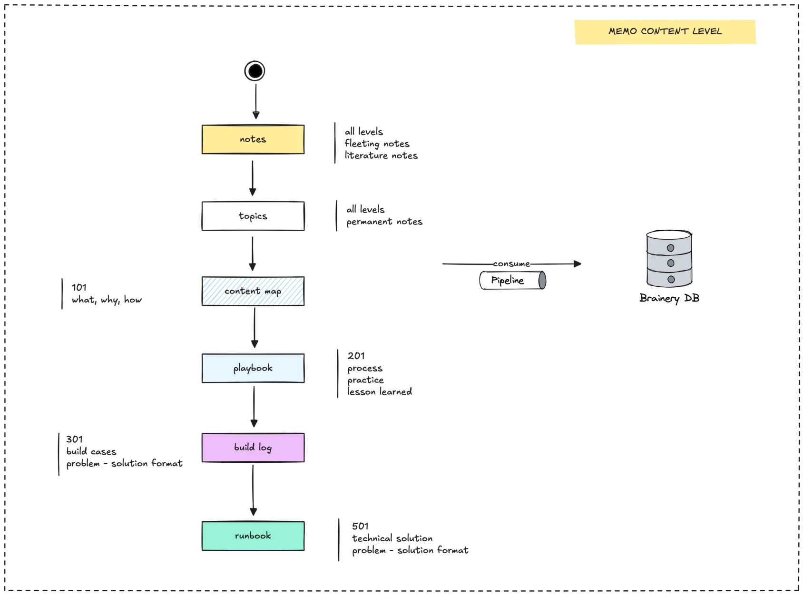

Our content starts as rough ideas and matures into polished insights. Here’s how we break it down into four levels, each with a clear purpose.

### Level 1: Fleeting notes in `notes/`

Every idea starts somewhere. In the Memo, new thoughts land in the notes/ folder as **fleeting notes**, quick drafts capturing project insights, questions, or sparks of curiosity. Anyone on the team can add to this folder, making it a low-pressure way to share.

Each week, our sorting bot tidies these notes. It updates the frontmatter (metadata like title, tags, and author) and suggests where the note belongs based on its strongest tag. For example, a note about JavaScript might get flagged for `topics/engineering/javascript/`. This keeps our ideas organized and ready for the next step.

### Level 2: Permanent notes in `topics/`

Once polished, notes move to the `topics/` folder as **permanent notes**. These are organized into **Maps of Content (MoC)**, linked collections grouped by theme, like engineering or culture. A filtering engine scans each note’s content and tags, recommending where it fits, ensuring every article finds its home.

Articles here focus on the basics: **what** a topic is, **why** it matters, and **how** to use it. For example, a note might explain “What is React, why it’s useful, and how to build with it.” These notes form a content map, feeding into our **second brain database** for easy access and future reference.

### Level 3: Playbook articles

Playbook articles take knowledge to the next level. Stored separately, these focus on **processes**, **practices**, and **lessons learned**. They’re practical guides, like how we streamline code reviews or manage remote teams. Think of them as recipes for getting things done, built from real experience. Like other content, playbooks feed into our second brain database, making them reusable across projects.

### Level 4: Build-logs

Alongside playbooks, `build-logs/` document specific projects and their challenges. These case studies follow a “problem-solution” format, capturing what we learned while building something like the Memo itself. For example, a build-log might detail how we designed the sorting bot, including technical hurdles and solutions. These logs are stored with playbooks and also enrich our second brain database.

## How the system works

Our content arrangement is like a well-tended garden: it starts with scattered seeds (fleeting notes) and grows into a structured landscape (permanent notes, playbooks, and build-logs). The Zettelkasten approach keeps ideas connected, so nothing gets lost. Content flows through these steps:

1. **Capture:** Team members add fleeting notes to notes/.
2. **Refine:** The sorting bot formats and categorizes notes weekly.
3. **Organize:** Polished notes move to topics/, playbooks, or build-logs, linking to related content.
4. **Share:** Content is published via GitHub Pages to [memo.d.foundation](https://memo.d.foundation/) and stored in our second brain database.

This system makes knowledge easy to find and use, both for our team and the wider community

---

> Next: [Make a MoC](make-a-moc.md)
