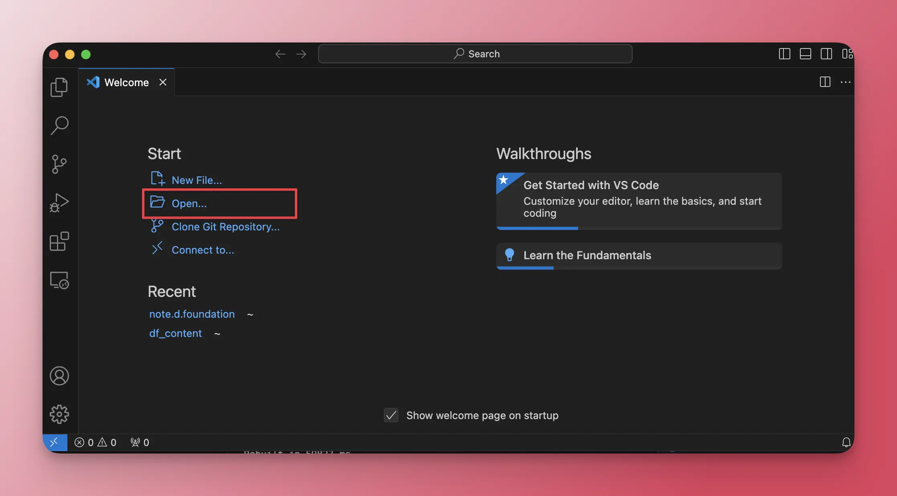
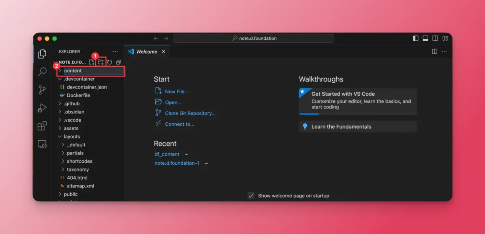

## Set up SSH key

SSH key is a secure authentication method which includes  a public key and a private key.

* The public key is shared with others (like GitHub), while the private key is kept secret on your Mac.
* When you connect to a server (like GitHub) using SSH, the server verifies your identity by comparing a fingerprint derived from your public key with the key it has on record.

During SSH authentication, the server you're connecting to (like GitHub) checks the fingerprint of your public key against the one it has on record. If they match, and you provide the correct passphrase to unlock your private key (if you set one), the connection is established securely.

To generate your SSH key, please follow this [instruction](https://g.co/gemini/share/3972239af940). The process including 3 steps:

1. Create ssh key pair (public, private)
2. Save private key to your computer
3. Submit public key to github

## Install the Visual Studio Code

Firstly, you have to install Visual Studio Code, [here](https://code.visualstudio.com/)

## Install the Devbox

1. Open the Terminal on VScode
You can use the shortcut `Control + ~` to open Terminal.


Then run this command in the Terminal to install Devbox: `curl -fsSL https://get.jetpack.io/devbox | bash`.

## Pull the Github Source to your local disk

You have 2 ways to pull the Github source to the local disk:


### Method 1: Use the terminal

1. Run the `xcode-select` command:

```sh
xcode-select
```

2. Install [git-credential-manager](https://github.com/git-ecosystem/git-credential-manager/releases/tag/v2.4.1). For Apple-silicon Macs, download the [gcm-osx-arm64-2.4.1.pkg](https://github.com/git-ecosystem/git-credential-manager/releases/download/v2.4.1/gcm-osx-arm64-2.4.1.pkg) file and run it. Otherwise, select the [gcm-osx-x64-2.4.1.pkg package](gcm-osx-x64-2.4.1.pkg).
3. Run these 2 commands seperately in Terminal to connect the Github account to the VScode:

```sh
git config --global user.email "you@example.com"
git config --global user.name "Your Name"
```

4. Run this command in Terminal to clone the repository:

```sh
git clone https://github.com/dwarvesf/memo.d.foundation
```

### Method 2: Link VScode with your Github account

Before you can clone the repo, you should connect your github account with the VScode. Then follow these steps:

1. Choose option Clone Repositories
2. Choose Clone from Github
3. Search repo `https://github.com/dwarvesf/memo.d.foundation` or `memo.d.foundation` and select to clone it


## Setup the environment on your laptop

1. Open the repository `memo.d.foundation` by directing to the destination of folder memo.d.foundation that you have saved when clone the repo.



2. Run submodule update by running these 3 commands in order and seperately:

```sh
git submodule update --init --recursive
git submodule update --recursive --remote
git submodule foreach --recursive 'git checkout main || git checkout master'
```

3. Create folder "content" under node.d.foundation folder



4. To preview all the changes on website, open devbox by running command `devbox shell` in Terminal. Then use command `make watch-run` to rebuilt the website.


6. After the command `make watch-run` finished, a localhost link would be generated. You need to open the link by `Cmd + click` to that link and you will have a preview of all changes you have made without affecting the main page memo.d.foundation


Note: If the localhost link has error, please run `devbox shell` and `make watch-run` again

On the next post, we will talk about [how to push content on memo.d.foundation](https://memo.d.foundation/playground/_memo/how-to-push-content-on-note-d/).
