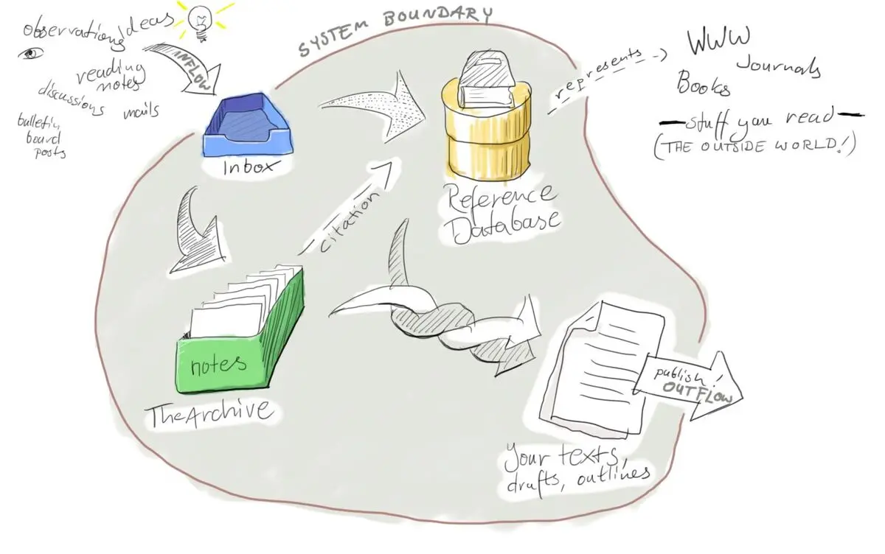
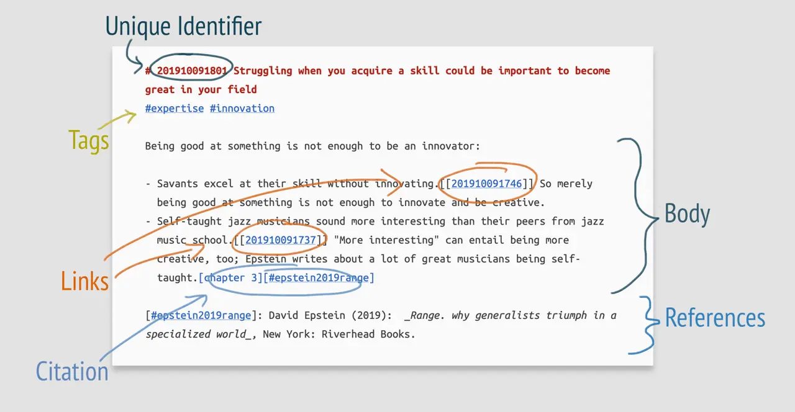
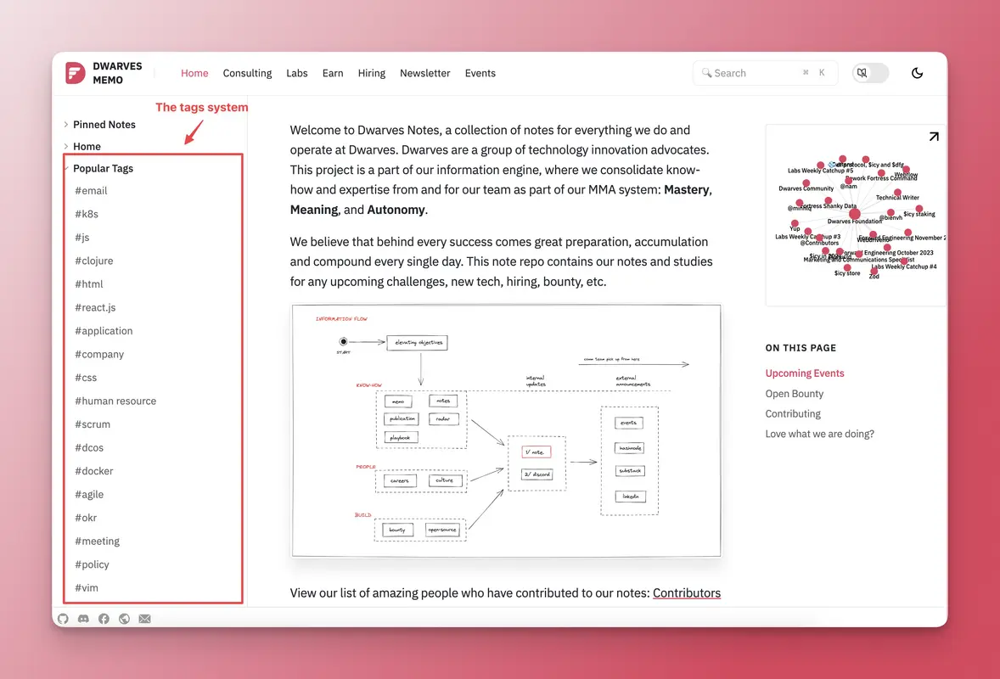
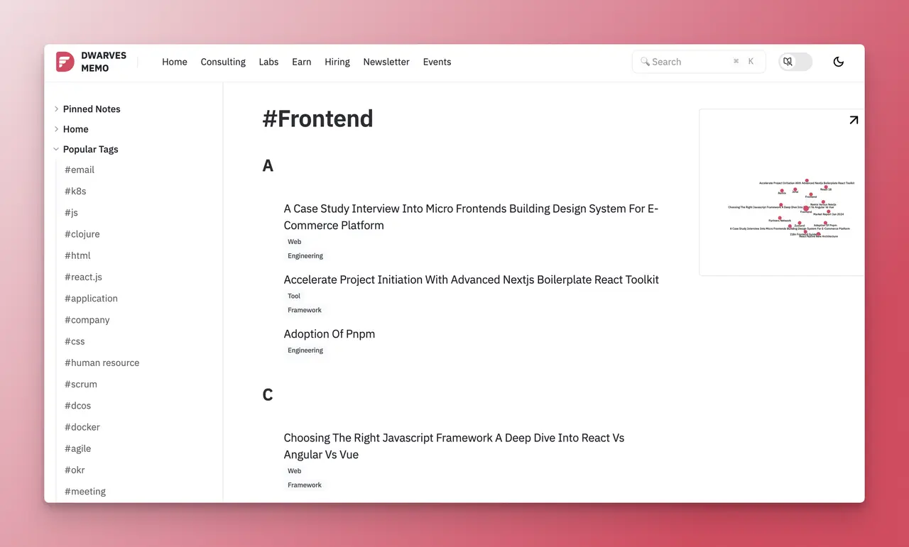
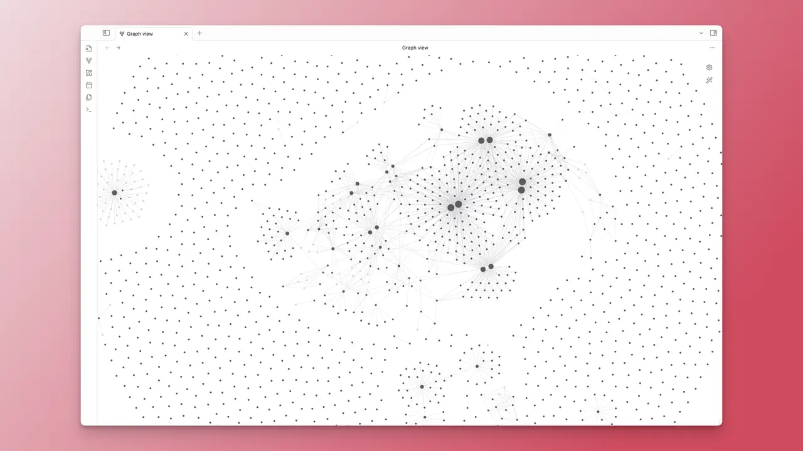

Whenever you dive into a topic, there's always a mix of what you know and what's new to you. It is important to leverage what you already know, learn new information related to it, and see the connection between them. When building memo.d.foundation, our team employs the Zettelkasten method to streamline all our memos, enhancing reader understanding and engagement.

## Zettelkasten method

### What is Zettelkasten method?

Basically, the Zettelkasten method revolves around capturing one idea per note and housing them all in one spot. You label and connect related concepts using tags and URL citations.

### Components of a note

1. **A unique identifier**. This gives your Zettel an unambiguous address. For example: unique ID, URL
2. **The body of the Zettel**. This is where you write down what you want to capture: The piece of knowledge.
3. **References**. At the bottom of each Zettel, you either reference the source of the knowledge you capture or leave it blank if you capture your own thoughts.

### Types of note included in Zettelkasten

There are several different types of notes that you can add into your Zettelkasten. Here’s a quick overview:

1. **Fleeting Notes:** These are for quick, temporary notes that capture in-the-moment ideas and learnings. They're not meant to be comprehensive or polished, but are meant to capture your thoughts so that you can refine them later.
2. **Literature Notes**: When you learn something from reading, create a literature note. These notes capture the key points and ideas from the books, articles, or other sources that you're studying. Remember to keep each literature note a single idea, as opposed to a collection of learnings from what you read.
3. **Permanent Notes:** These are the notes that you want to keep for the long-term. They’re made up of the notes you’ve grouped and connected together. Think of it like a summarization of your ideas.
4. **Reference Notes:** These notes act as “connectors” within your Zettelkasten. Think of them as the table of contents or legend that tell you where to find what information, or which notes connect with which. For example, if you’re using a star to mark notes that came from the same book, you can define that in a reference note. If you’re using a digital Zettelkasten, you might not need to create reference notes.

### How the **Zettelkasten Method improve the way we think and our writing skill**

- **Clarity in Thinking**: Writing forces you to clarify your point, helping you stick to it coherently.
- **Consistent Development**: Writing down thoughts prevents mental leaps, ensuring consistent development of ideas.
- **Improved Memorization**: Putting thoughts on paper aids memorization.
- **Guarding Against Bias**: Written thoughts remain unchanged, tackling hindsight bias effectively.

## How the team applied the Zettelkasten method

### The tags system

When a user enters Homepage, all the tags are listed on the sidebar and nested in the section Popular Tags. Each tag represents a topic and contains all the post of that topic. All the memo will attached with at least 3 tags that are related to the memo topics which allow readers to find content easier and look for connections to other notes.

When readers choose a tag, all the related post will be listed, with chart on the right side to show how all post are linked with each others and the tag.

### The Map of content

Our team use the Zettelkasten method to organize the map of content by usiing Obsidian. All of the files are stored in the form of markdown first, then they will be categorized into certain topics. The map of content provides a high-level view of interconnected notes which offers a flexible and connected way to organize notes.

