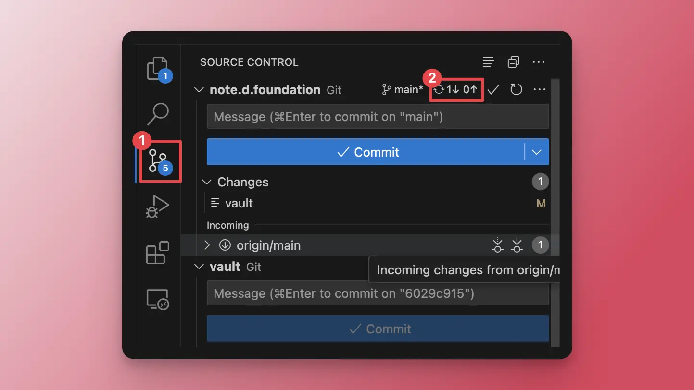
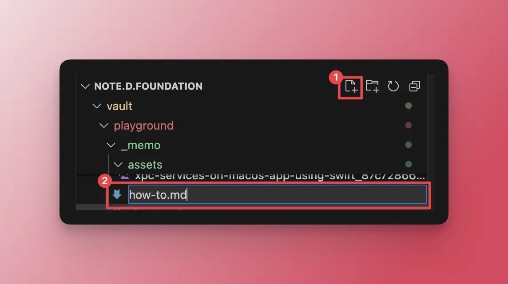
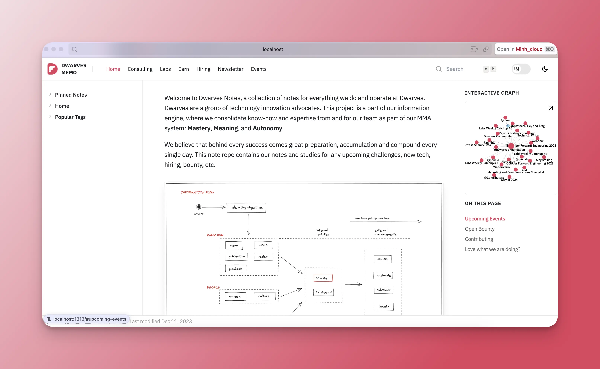
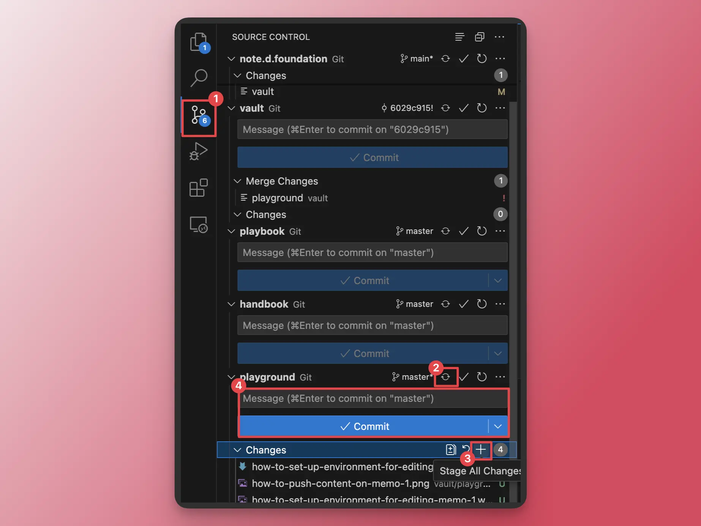
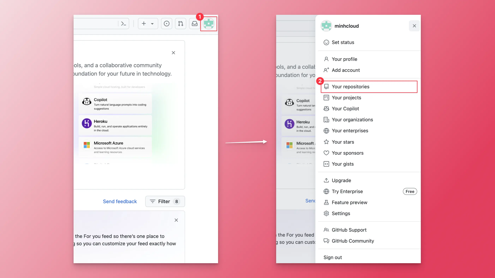
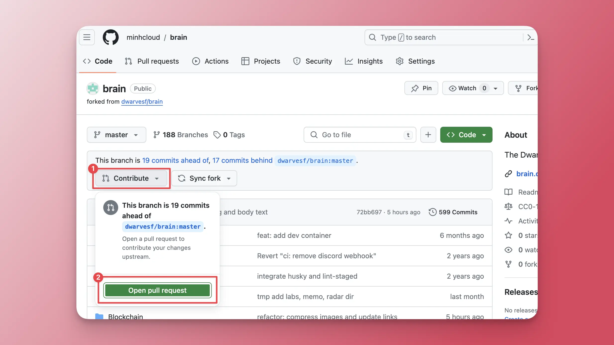

## Before edit or create a new post

Before you can create a new post, please make sure that you have finished setting up the environment for editting memo in this [post](https://memo.d.foundation/playground/01_literature/how-to-set-up-environment-for-editing-memo/), and you have the right access and edit the repository memo.d.foundation.

Everytime you want to edit or create a new post, please make sure that the data of your local files is up-to-date by going to Source Control and Sync all the changes in the memo.d.foundation repository.



## Create a post

1. Choose a folder that you want to nest your post in. If you don't know where to place your note, just leave it in the folder `vault/playground/00_fleeting`.
2. Click to the icon New files, and enter the name of new file. Remember to add the suffix `.md` after the file name to segment the type of file.



3. Insert the code for metadata on the top of your post.

```md
---
title: [The title]
date: yyyy-mm-dd
description: [your description]
authors: [your name]
tags:
  - [tag1]
  - [tag2]
  - [tag3]
---
```

4. Start editing your post below metadata section.
5. After finish editing, save the file by `Cmd+S`.
6. To preview all the changes on website, open devbox by running command `devbox shell` in Terminal. Then use command `make watch-run` and open the localhost link.



## Review process

After you finish editing the post, you need to capture the whole page of your post on local link, then send it to your supervior and @anna to review.

We suggest you to use Scrolling Capture of [Cleanshot](https://cleanshot.com/).

## Commit changes

After editing, your post is only saved on local files. To post it to memo, you will need to create a request for administrator to approve. Before creating a request, you need to commit all changes first:

1. Go to Source control section.
2. Sync all changes in memo.d.foundation and in the branch you edited.
3. Stage all changes of the branch you edited.
4. Name the commit and press Commit button.



## Create pull request

Now, you should go to your [Github](https://github.com/) and log in. After that follow the guideline to create pull request:

1. Open the profile dropdown and open Your repositories section.



2. Choose the branch that you have edited.
3. Open the pull request list.



4. Choose the commit and Create the pull request.

Now all you need is waiting for admin to review your request!
