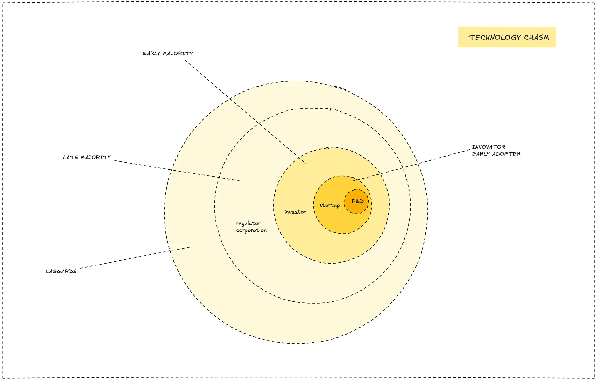

Technology comes in waves. You've likely noticed this cycle. AI is the current big shift, but before that, we adapted to DevOps, mobile, and the cloud. Each wave brings new tools and changes what clients need from us.

As a consulting company, we offer tech know how to help others succeed. Just mastering today's tools isn't enough. A core challenge is understanding and adapting to these ongoing tech changes. Clients trust our knowledge. They expect us to be skilled with current tech and aware of what might come next. Technology doesn't stand still. If we fall behind, we become less useful and competitive.

To stay relevant, we need a way to look ahead and adapt. This means asking ourselves key questions:

- Which technologies might form the next wave?
- How can we best position our team's knowledge and skills?
- What lessons did we learn from past tech cycles?

### How we adapt

Big platform changes or tech breakthroughs can trigger our process. We've developed a data-driven way at Dwarves to handle these shifts, which involves several stages.

First, we **gather information**. We collect data from public sources like industry news and market trends, and from our internal discussions, like those on Discord. Insights also come up from our own project experiences.

Next, we **understand the data**. We analyze this information, looking for new keywords or trends, to spot promising new tech. Once we identify a potential technology, we dig deeper by asking important questions: What are experts and the community saying about it? Can this tech help us or our clients build something valuable?

Finally, we **make decisions**. Based on the answers, we decide how to proceed. If a technology looks promising, we might develop needed skills within the team, create demos or content to explore what it can do, or join early events like hackathons to get more involved. We also make sure to document what we learn from each cycle.

This structured, data-driven approach helps us evaluate new tech methodically and stay prepared.

### Tools we use

To support this process, we build internal tools like the [knowledge base](knowledge-base.md) and the [Tech Radar](community/radar.md). These tools help us:

- Collect and organize information consistently.
- Make sense of new trends.
- Decide which tech to adopt or explore further.

The aim is to manage tech changes predictably, support our growth, and keep our ability to react well when things shift unexpectedly.

### Your role in this

This process works best when everyone adds to it. Understanding how we adapt to tech changes is the first step. You can get involved by sharing relevant articles, news, or insights you find, sharing your observations from projects or client talks, and helping organize information in our knowledge base or suggesting ways to improve our tools and process.

Your input strengthens our ability to handle the future. It shows you're thinking not just about your daily tasks, but about how we collectively stay ahead. Your involvement helps keep us all prepared for what comes next.
