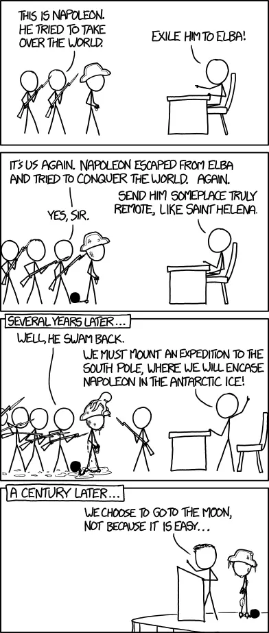

# Work routine

As stated in [how we work](how-we-work.md), we keep the team small and follow the agile philosophy at scale.

We work in an 8-week cycle at Dwarves Foundation. There are typically six cycles to a year. This fixed cadence serves to give us an internal sense of urgency, work as a scope hammer to keep projects from ballooning and provide a regular interval to decide what we’re working on.

End of the cycle, we do cycle review and celebration. Achievements & contributions are recognized. We hunt down the next bytes. We publish tech radar study to our friends and audiences. We take a cooling time and start planning for the next cycle after that.

## A typical working day

- 9 am Monday, there is an Operation meeting between the head of all the team. They check up the status and list out what they need to do this week.

Basecamp sends out the Digest email about recent activities.
Basecamp start questioning “What will you be working on this week?”

- 10 am Monday, there are several Sprint Planning meetings to get people on the ground if it is the first Monday of the sprint. People start working.
- 12 pm, lunchtime and take a short break to 1 pm.
- 3 pm Friday, the team close the sprint to do Retrospective meeting if it’s the last Friday of the sprint.
- 4 pm Friday, there are several team meetings of Engineer and Design team if it’s the last Friday of the month.
- 5 pm, Basecamp start questioning “What did you work on today?”
- 6 pm, the Dwarves leave the office.

## A working week

Our usual week starts on Monday, but for some mates, we form a todo list from 7 PM on Sunday. Folks, sound familiar?

### Monday

Monday tends to fall for Business Planning and Project Meetings. Since our working hour starts at 9 AM, all these meetings might end right before your lunchtime. Working hours or task catching up will take all of your afternoon. If you're lucky, you may get some mini task done by the end of the day.

### Tuesday

Tuesday is not much different. Apart from team projects, we still have multiple stand-up meeting with clients. If you have things to discuss with the team or tasks to handover/ delegate, this should be the right time. Try not to leave it in the middle of the week. If tasks are assigned on Wednesday or Thursday, it's likely to be postponed or delayed to the next week. This is speaking from experience.

### Wednesday & Thursday

These twos should be your most productive workdays of the week when you spend the focus and energy on cleaning up the plate.

### Friday

This day comes faster than you think. Trust me. We use Friday to wrap up the weekly work, keep the team posted about what went well and what's next to do. Project Status meeting takes place at 1 PM every Friday for PM to update about their team's progress and client's feedback also.

### Saturday

This depends on you. Usually, our week ends on Friday afternoon. The weekend is spent on self-treat and family. So it's safe to use it for non-work related, pack your back and leave for a weekend getaway.

But some of us still use Saturday for hotfixes or work on some side projects that catch their interest. The team's newsletter will also be delivered to your inbox on this day, as a wrap-up note to make sure you won't miss anything.

## What we work on

Beside daily client projects, we also play with some cool stuff. In other words, these are the activities where the team spend time together.

### Products

Most of these works are about open source or create products that scratch our own itches. We'll experience it for a while and adjust as we use until we believe it's safe to bring it out to the market.

Fortress: Our robust self-built system that contains all of our data. Employee information, project status, ranking level. Fresh Dwarves may get their hands on this after finishing their training period, get to know our first and foremost work as a team.

[Superbits](superbits.co): The open-source development project run by the macOS team. After years of working and learning, we figure it's time to give back those output to the community. Every tiny bit in this project aim for simplicity and boost up productivity.

[sudo.fm](sudo.fm) is our website for music player. Besides the dope playlist, we also add up catchy ambiences to better create a vibe for our moods. Work, sleep, code and chill.

[Readify](readify.app) is the knowledge hub we create, to pin tech news that matters. It works as a platform where we get to save and share our favorite and useful articles to ourselves and amongst the team.

### Ventures Product

[Dwarves Ventures](dwarves.ventures) is our investment arm. We invest finance and resource on venture deals and take over the technical part in exchange for equity. In other words, we work with them to shape up their product and level it up.

> Check out: [Venture deals & Internal Products Incubation](https://3.basecamp.com/4108948/buckets/9403032/messages/2809224784)

### The Tech Radar

Yes, it's hard to survive in the software industry without discovering new things. Tech Radar recurs every two months, where the Dwarves research technologies they find interesting or helpful to the team on daily work. The qualified work will later be honored and published externally.

> More on [tech-radar](learning/tech-radar.md)

## The second period

Come back here when you passed the first probation. I hope you are getting well with your peers. Make it through the first period guarantee you a job. But to join the force, it requires more than that cuz you need to make through the second.

We started this team with a purpose. It's an innovation powering. The long-term goal is to create an engine for innovation where new ideas happen, we can develop things & bring positive impacts via massive software distribution. We want to make this place an environment where engineers can spend their time working with disruptive startups and be cool at the same time.

To achieve that, it requires a lot of hard work and commitment. We work around the clock toward that goal. It's why we always look for like-minded people, who with the same vision, DNA and same synergy.

Find your purpose here.
People who don't find a sense of purpose don't find us so well.

---

> Next: [Who does what](who-does-what.md)
