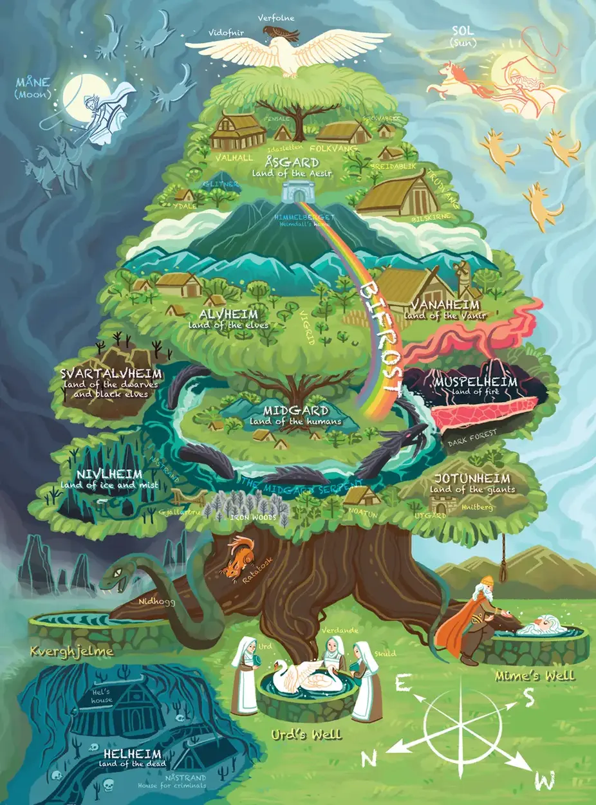

## Empower Innovation with Software Craftsmanship

Innovation happens constantly. Every day, startups form and secure funding to pursue their visions, striving to create positive change, impact millions of lives, achieve breakthroughs, and build foundations for economic growth.

But building an innovative startup is incredibly challenging. Founders juggle business development, legal considerations, fundraising, team building, and product development simultaneously. They need to move quickly and often "break things" along the way.

As these startups grow, they eventually need a strong, experienced team behind them. This is where we come in, providing the software expertise that helps design robust systems, create effective databases, produce well-crafted code, maintain stability, avoid technical debt, and deliver real value. We're a critical piece of the innovation puzzle.

## Why we created Dwarves Foundation

We started Dwarves Foundation partly in response to the lack of respect that service firms often receive. Many software companies focus solely on digital transformation and consultancy, operating under tight deadlines and budgets that force them to cut corners. They "hit and run," leaving behind codebases full of problems, an approach that damages our professional pride.

Despite the limitations of service firms, linear scaling, smaller ultimate size, and fewer opportunities for life-changing exits, we built Dwarves Foundation because we believe in building things right. Companies like ours are more vital to the economy than they're often given credit for.

## An innovation service firm

Since 2013, we've been building an organization with high software development standards and strong business growth capabilities. We help tech startups, entrepreneurs, and makers deliver innovative software products that make a difference.

## Champions of software craftsmanship

Rather than simply telling people how to build software, we take responsibility for collaboratively creating innovative products with our clients. We value long-term partnerships that generate economic impact through quality software that reaches the market through our clients.

This commitment to craftsmanship takes many forms, and we're constantly working to improve our approach.

## Our name: The Dwarves

Our name has roots in Norse mythology. After Odin executed Ymir, the first giant of the universe, he created a new cosmos centered around Yggdrasill, a massive ash tree that cradles the nine realms.

Dwarves began as small creatures originating from Ymir's corpse. They made their home in the mountains deep underground in Svartalfheim. These beings possessed natural wisdom and exceptional skills in smithing, mining, and crafting. They became renowned as the finest blacksmiths across the nine worlds, excelling not just in creating weapons and jewelry, but also as engineers and architects.

The magic of the Dwarves wasn't flashy or showy, it was their extraordinary technical knowledge and craftsmanship. There was no shimmering light surrounding them, just exceptional workmanship. They took immense pride in their craft, whether smithing or any other pursuit.

Dwarves represent beings whose abilities transcend the known world, pointing toward possibilities beyond the physical realm. Their existence expands our imagination of what's possible.

## Living our values

We chose the name "Dwarves Foundation" as a commitment to our vision of creating positive breakthroughs that can reshape the world. In our woodland, we encourage thorough assessment and evaluation of product quality before delivery to customers.

By participating in every detail of our work, we make craftsmanship a fundamental element in the professional development of our engineers. Creating world-class products requires world-class engineers, and craftsmanship is what makes this possible. Craftsmanship flows through our team spirit, or doesn't exist at all.

We've chosen innovation as a core value because we believe in forming ideas that positively impact society. Innovation isn't the work of isolated geniuses, it's an activity requiring team effort. Being innovative helps us approach the new era we're building together. The rewards of this approach can genuinely help remodel our world.

---

> Next: [The Purpose](purpose.md)
