# What we value
Before anything else, values come first. The value is important to us. They are what we proud of. They help guide us when we are facing a difficult decision. They will be the things you like about what we do at Dwarves Foundation and how we do it.

Our core values guide our strategies and individual actions so that we create a company whose character is as radical as our work. 

- **Craftsmanship**: We work toward perfection in every single piece that we produce. We are proud of the well-crafted software that we develop together.
- **Teamwork**: Teamwork is all about trust and collaboration. Having someone in the team mean we can rely on this person.
- **Sustainable**: We think long-term. We do not believe in rushing for project and working overtime. We believe in working sustainably and balanced so that we are a happy bunch of sane workers. Software requires good brains to create good codes and good processes.

# Culture Code
There is no such specific guide for culture code. So many of these employee handbook projects turn out to be ideal-case prescriptions rather than real-world descriptions. They cover all the ways people should act, not the ways they actually do. That’s a sham. Let’s not write a handbook like that. **Let’s keep it honest.**

We believe the culture is defined by whom we hire, what we promote and encourage. It is dynamic, and it should expand like our business. We welcome its change as long as we still stay on the ground. Just like we want people to contribute new skills and ideas, we want people to contribute to the new culture.

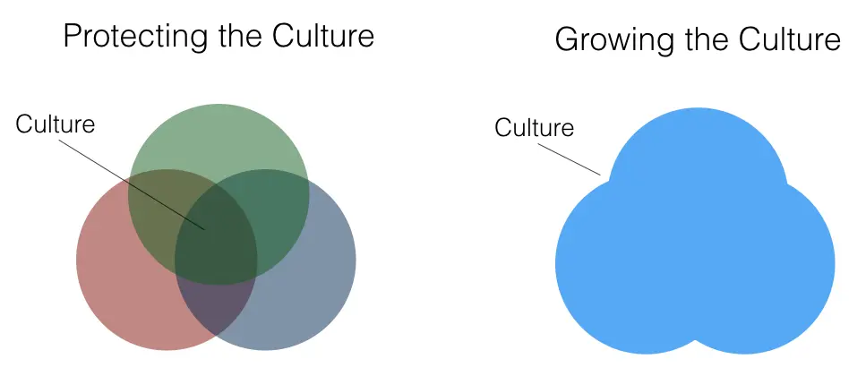

A few other things that we observed over the last few years:
- [**No asshole rules**](https://www.amazon.com/Asshole-Rule-Civilized-Workplace-Surviving/dp/0446698202): no matter how great a candidate may be, being an asshole is an automatic deal-breaker.
- **False Positives are ok. False Negatives are not**: we prefer to not have you in the team rather than letting a wrong person affect the others.

## People
### It all started with people
Yes, it does. Everything only makes sense with us, the human at the centre of it. Everything we want to accomplish starts with our will. Any ideas of how to make a better future begin with us. This company focuses on innovation, and those result only matter if they benefit us. We are in the centre and are the beginning of everything.

At Dwarves, you are the manager of yourself. Things you produce add up to our value. Your action in front of others represents our image. Your belief impacts team culture. When things went wrong, we look into the team and the inner self, rather than pointing the finger. After all, we human are the cause of any consequences. That's our point of view. 

So, live your value with the Dwarves. You are encouraged to contribute your knowledge and value to the team. 

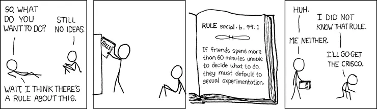

### Team > I
Working in a team is like riding a boat, it requires collaboration. The team need heroes, and there should be an 'I' in the team, but the only way to make the boat go fast is perfect coordination, it also means perfect teamwork and synchronization. The skillset is essential, but it isn't as important as vision and coordination. The 'I' must be unselfish and think about the team first. 

As a team member, it's important to remember that no one is perfect; everyone has something that they could improve upon, including yourself. So, be supportive. Offer constructive criticism. Listen, listen, listen. People who always talk, but never listen will be stunted in growth.

> "Everyone you will ever meet knows something you don't." — Bill Nye

We effectively have an environment in which competition and collaboration co-exist and feed off each other. Competition, synchronization or collaborating perfectly; make the boat go fast is always the main point. Remember, even if you work harder than anyone else, if you lose synchronization, you slow the boat down.

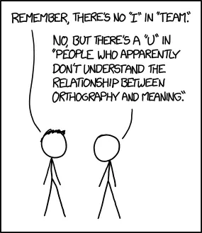
    

### It's not about you
Everything that happens here is not about anyone in this company. It's not about the CEO, the core team or anyone. They are here because they want to join forces to accomplish the mission of craftsmanship in software engineering. They want to pursue the ultimate goal of empowering innovation.

The Dwarves is more like an idealogy. When we start this company, we think about how cool it is to make the idealogy happens, how cool it is to bring impact to the world and make a meaningful living.

The portion split accordingly. We have rules for the Dwarves who are in that same path, who also want to contribute and make the next products feasible. We work together as a team for a greater good because as soon as it becomes about the individual, things begin to fall apart.

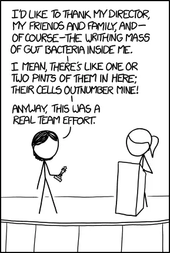

### Like-minded people
We started this team with a purpose. It's an innovation powering. The long-term goal is to create an engine for innovation where new ideas happen, we can develop things & bring positive impacts. We want to make this place an environment where engineers can spend their time working with disruptive startups and be cool at the same time.

To achieve that, it requires a lot of hard work and commitment. That's why we always look for like-minded people, who with the same vision, DNA and same synergy. The ones which are distinctive, different, can see things in their bare form and be optimistic about the future are the right people we'd love to work with.

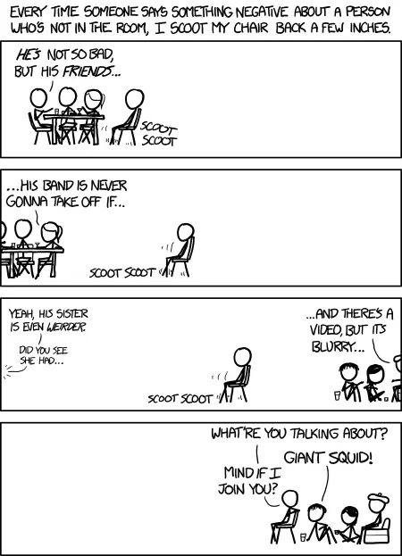

### Unique Value
When it comes to hiring, we look at the good part of every person. We hire for the unique value. This is what you could bring to the table. This is what makes you different from other team members and me.

Being different from others is always a source of value. The difference can be anything. The way of thinking could be different. The vision of technology. The methodology of operations. Presentation skills. Communication skills. Leadership. The speed of prototyping. Emotional understanding of others. Anything can be the difference.

We must be an organization where those specialities are well respected and leveraged, rather than having stereotyped technical skill evaluations like school exams.

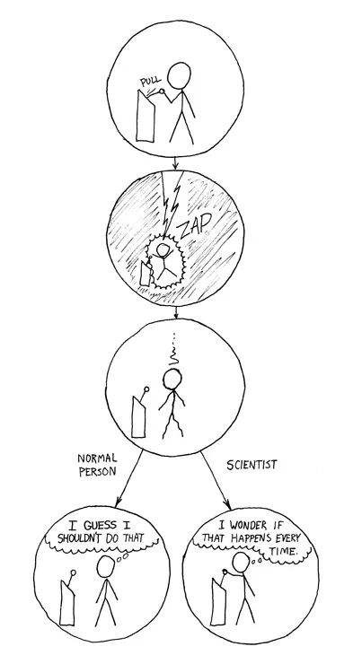

### EQ is underrated
We have seen so many cases where smart engineers with high IQ failed while some others yield positive results. Most of the time, it is communication.

At times, Clients often tell us what *feature* needed to be done rather than what *problem* they wanted to solve. Failing to see it through will lead us to a stage where it is technically impossible to do the *feature* while there many other possible approaches to the original *problem*. This one, along with many similar cases is why Clients (and people) prefer working with someone (or company) to another.

As a software firm, it is our job to convince and recommend *solution*. Features, tasks and bugs live in one side of a coin where technical matters and solution are already identified. Train your mind to be able to see the real big picture.

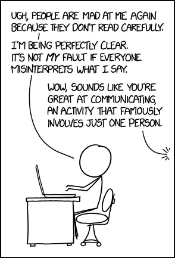

---

### You are what you do
People see you through your action, not talks. Be a doer. We craft software and stuff. We want to bring positive impact to the world through software. 

At Dwarves, we favour building over talk. Working with other Dwarves, we prefer to work with one who brings value to the table and make things happen.

The culture we are pursuing is the combination between the unconventional spirit and the will to do the right things in every piece of our decision, not just follow the existing of which has been said for years.

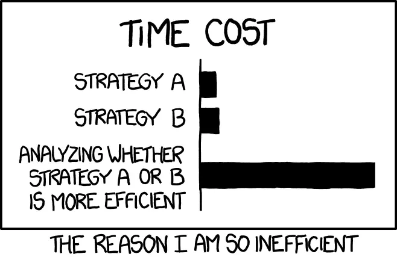

## Work
### Remote Working
We feel no need to manage your chair. In other words, we have better things to do than to track you down to every single minute. Meetings are for decision making. Ideas and planning should be conducted personally.

But that doesn't mean things can go off the track. Flexible working time can be a double-edged sword. It allows you to start and end thing at whenever you feel like it, which is why we want the Dwarves to know exactly how their day will transpire. What needs to be done. What's left to clean up. 

It doesn't matter if it happens in the kitchen, or on your way to the beach. Work happens when you are ready, and we want you to manage it at your own terms fully. Just make sure you know when thing happen and what to do about it. That's all we need. 

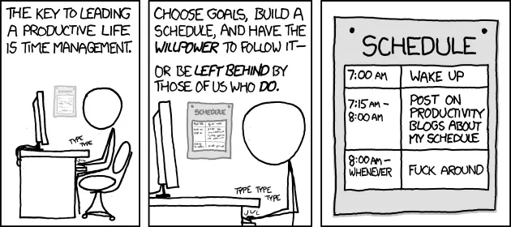
    

### Around the clock
We work for the future of ourselves and the future of this team. We care about the quality of the work we produce rather than the number of hours worked. We do not have a specific start time or time to leave the office. 

The Dwarves are working in a different timezone. We stay in touch around the clock. The Dwarves are around when you need them. Just don't try to take advantage of someone's balance.

### Toward automation
Time is the only real currency that we have. All the techniques we applied, all the new technologies we learned at Dwarves Foundation help to save time and make automation easier. If there is anything happened more than 3 times and a dozen more in the future, we find a way to automate it. 

Software is eating the world. The thing we did today the machine can help to do it tomorrow. Having the engineering power aside, if we know how to use them efficiently, we can utilize them for most of our tedious work and focus on things that matter. Try not to repeat yourself. 

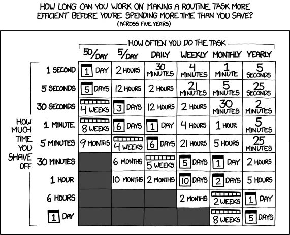

### 70/50
The Dwarvish magic is purely technological know-how. The Dwarves often spend their free-time on hobby projects or new technology.

The 20% we put more into our work is the extra effort to increase the chance to reach a new height. The total of 120% is our commitment. It's encouraging for most of us and not required. The 20% more are rewarded when things we build or explore hit the market or bring values to the customers.

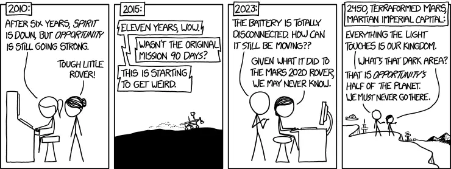

### Purpose-driven
It's all about the result, thus every action or decision should either bring us closer to the goal. Working with the client as the consultant, we should be aware of what makes a successful collaboration.

Remote clients are always worried about whether we can deliver. No updates are assumed no "working". We don't manage chairs, but not everyone does. Transparency and detailed planning/report help. Insist on (meaningless) daily meetings for updates is a sign of trust issue and cargo cult agile.

- Remember to make the development progress as transparent as possible
- Be a team player over "task worker".
- Favour open discussion and alternative recommendation instead of rejection over customer's requests

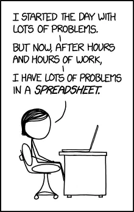

### How we do business
In working with others, we don't look for business, we look for partnership. We value lifetime partners. A deal could come and go, the market could come and go, but trusted clients will stay. When you worked with someone else, once people know that we can actually deliver well-crafted output, nobody wants to take another adventure to check out other options or vendors. It's not worth the extra effort to do that.

Same as networking and collaboration, doing business is about giving, not taking. We tend to pay upfront in many cases, we give what we have before asking anything back.

Unfortunately, many people do not have this perception when it comes to dealing business. People often view business as "what can you do to support me?", rather than "what can we do to grow together?" perspective. Maybe it was because the modern world has been filled with doubts and skeptic, or maybe it was because of the bitter past experience when they chose the wrong partners, modern business owners tend to focus more on getting the fast, instant goods, rather than investing in a long-term, sustainable plan.

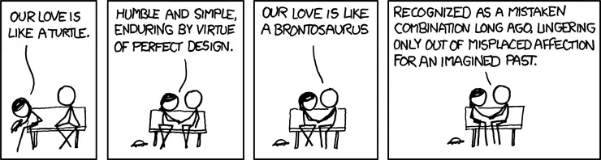

### Delegators are dead-weight    
Everybody works. With a small team, you need people who are going to do work, not delegate work. Everyone's got to be producing. No one can be above the work.

That means you need to avoid hiring delegators, those people who love telling others what to do. Delegators are dead weight for a small team. They clog the pipes for others by coming up with busywork. And when they run out of work to assign, they make up more—regardless of whether it needs to be done.

Delegators love to pull people into meetings, too. In fact, meetings are a delegator's best friend. That's where he gets to seem important. Meanwhile, everyone else who attends is pulled away from getting real work done."

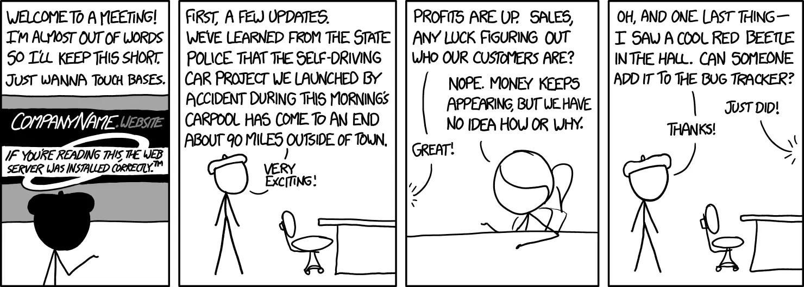

### Effective over productive
Being productive is about occupying your time—filling your schedule to the brim and getting as much done as you can. Being effective is about finding more of your time unoccupied and open for other things besides work. We don't believe in busyness. We believe in effectiveness. 

In a certain amount of time, we always try to work on things what create the most value possible. Between signal & noise, we always try to pick the signal and waive the noise.

Know your priority and do things that matter.

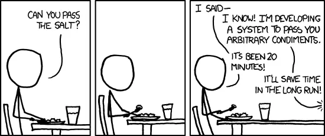

## Engineering Culture
We build a company where software engineering could shine, innovative products are shipped and change the world for the better.

### Engineering Discipline
Software engineering is an engineering discipline that's applied to the development of software in a systematic approach.

Not applying software engineering methods results in more expensive, less reliable software, and it can be vital in the long term, as the changes come in, the costs will dramatically increase.

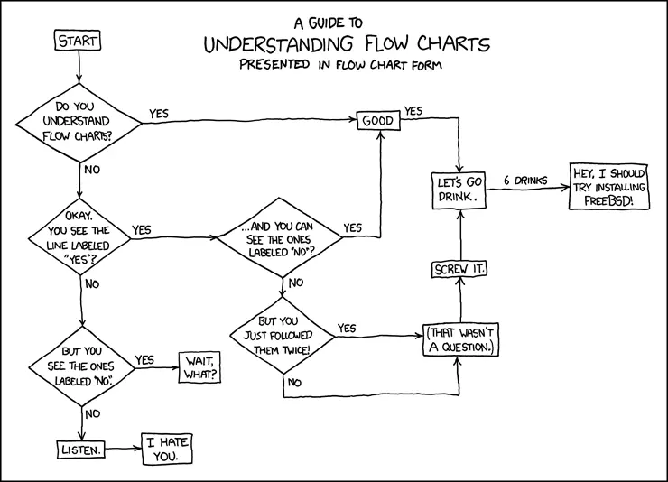
     

### Not a replaceable cog
In every software, the engineering team is one of the most crucial factors to make it successful. Software is more of artisanship, and software engineers aren't a replaceable cog.

People have an assembly line mindset leftover from the industrial age. Don't believe the one-size-fits-all interview process with white-boarding problems. These serve to grind away the individuality and make us feel like an assembly line worker.

### The best idea wins
If you have a great idea and the will to make it work, you can create great changes. Nothing is off-limits — we're continually looking for improvements in our people, our processes, and our products. All voices are equal here — we hire people to have opinions and perspectives. 

If your idea makes the most sense, that's what we'll do, regardless of your role or seniority.

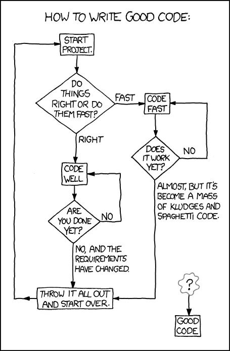
    

### Lean approach
Lean philosophy regards everything, not adding values to the customer as waste. In order to eliminate waste, one should be able to recognize it. Partially done work, extra processes like paperwork and features not often used by customers are waste. Rework, or unnecessarily complex solutions are waste. Waiting for other activities, teams, processes is waste. Managerial overhead not producing real values is waste.

Approach and process are not so much important than a fulfilled goal - the only matter. As such, fancy tools and cumbersome procedures are likely to bring more problems than helping us moving forward.

During work, always remember that you are the manager of one. You should be aware of what is success and what is the priority of a specific period. There's always someone who will give false directions or noise. Catch the signal and waive the noise. 

Favour boring solutions and legacy tooling for real benefits over shiny, over-hyped new toys .eg "Hacker News trending", "10k Github stars in X days" or "faster than Y framework".

Be practical, don't waste time and effort on uncertainties.

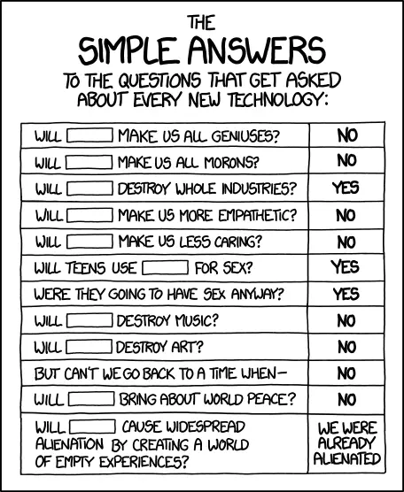

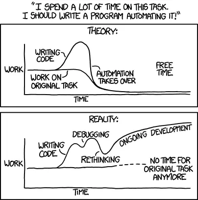

### Think long-term
How to know if we make the right decision?

Every action could create a continuous pair of cause and effect. 
When we make any decision, we follow a shared framework among the Dwarves. As everything here is not about you, it's about the majority. 

Every decision we make today can lead to an impact in the future. The technology we endorse, the solution we choose to solve the problem; The founder we backed, the startup we invest into; The people we work with, the way we treat the client. It also includes how we talk about ourselves, the attitude toward peers.

We grant everyone at Dwarves the rights to make a decision as long as it benefits the whole in the long run, rather than the individual or a blink of an eye. It is the balance of one who walks a tightrope.

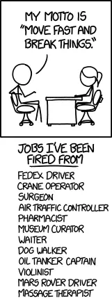

---

## Toward the future
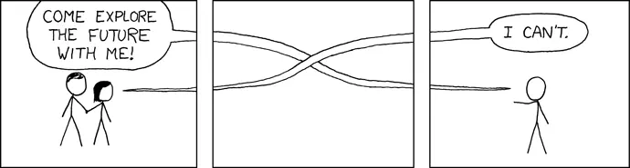
    

### Thought on software
The world is running on software. Software is all around us, yet few people think much about the many ways that software impacts the world every day. Software is used by businesses to communicate worldwide. It is used to operate some of the most complex medical machines. The software also helps make life convenient.

Software is eating the world. Whatever the future holds, it is a good bet that software will remain an essential part of it. As computer software becomes more sophisticated, it will help people with more complex challenges.

In the future, the software may even help us to regulate and improve our own bodies. Today's wearable technology and implanted medical devices are just the beginning of what the next generation of software can do.

Tech industry is the destination and interference zone between sectors. It's the most fast-pacing environment and the future where human will put all the effort to push its boundary.

It's the tunnel to the future. The performance and survival of a large number of organizations now depend on their ability to integrate digital at the heart of their business strategy. The world can't operate without software.

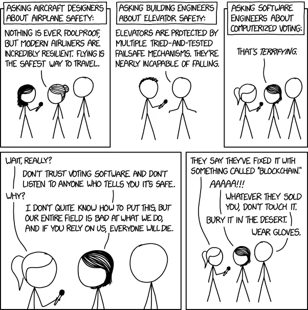

### Build the resilient future
The humankind is standing in front of a huge opportunity to increase the boundary of many sectors. The future we are heading to is full of excitement and dynamic. Without the ability to judge what is good for the later generation, we may encourage action with bad impact unintentionally.

So as an ambitious team who is going to co-create the future together with startups and makers, we should always be aware of our actions and think long-term. It's the only way to prevent us from making the wrong decision and create a sustainable future.

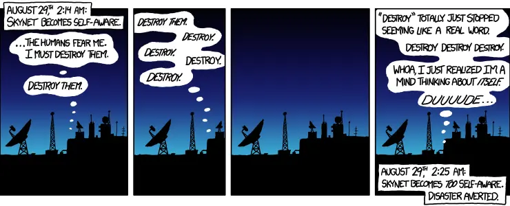

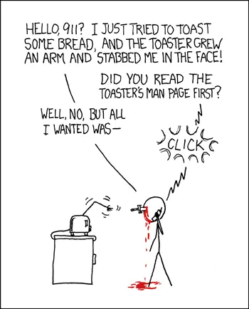
