Values come first. They guide our decisions, shape our culture, and define who we are as a company. They're what we're proud of and what helps us navigate difficult choices. They'll likely be what you appreciate most about working with us.

Our core values guide both our strategic direction and our day-to-day actions, creating a company whose character is as distinctive as our work:

- **Craftsmanship**: We pursue excellence in everything we create. We take pride in developing well-crafted software together.
- **Teamwork**: We build on trust and collaboration. Being part of our team means we can rely on you, and you can rely on us.
- **Sustainability**: We think long-term. We don't believe in rushing projects or working excessive hours. We value balanced, sustainable work that keeps us healthy, happy, and producing our best.

## Our culture code

There's no rigid formula for culture. Too many company handbooks present idealized versions of how people should act rather than honest descriptions of how they actually do. We're committed to keeping it real.

We believe culture emerges from who we hire, what we celebrate, and what we encourage. It's dynamic and evolves with our organization. We welcome change as long as we remain grounded in our core values. Just as we want people to contribute new skills and ideas, we welcome their contributions to our evolving culture.

Over the years, we've developed a few additional principles:

- [**No asshole rule**](https://www.amazon.com/Asshole-Rule-Civilized-Workplace-Surviving/dp/0446698202): No matter how talented a candidate may be, being difficult or toxic is an automatic disqualifier.
- **False positives are acceptable, false negatives are not**: We'd rather pass on a potentially good hire than bring in someone who might harm our team dynamics.

## People

### It starts with people

Everything begins with us, humans. All we want to accomplish starts with our will and vision. Our ideas for creating a better future begin with people. While we focus on innovation, those results only matter if they benefit people. We are the center and beginning of everything we do.

At Dwarves, you manage yourself. What you create adds to our collective value. How you act represents our image. Your beliefs influence our culture. When things go wrong, we look inward rather than casting blame. Ultimately, we humans create our own consequences.

So, bring your values and contribute your knowledge to our team. We're better because of what each person brings.

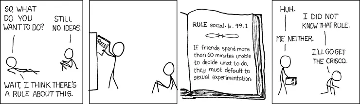

### The team comes first

Working with us is like rowing a boat together, requiring perfect coordination. While we need individuals with excellent skills, the team's success depends on synchronization more than individual heroics. The skillset matters, but vision and coordination matter more. Every individual must think of the team first.

As a team member, remember that everyone has room to grow, including yourself. Be supportive. Offer constructive feedback. And most importantly, listen. Those who only talk without listening limit their own growth.

> "Everyone you will ever meet knows something you don't." , Bill Nye

We've created an environment where healthy competition and collaboration coexist and strengthen each other. Whether competing or collaborating, making the boat move faster is always the goal. Remember, even if you work harder than anyone else, if you're not in sync with the team, you'll slow everyone down.

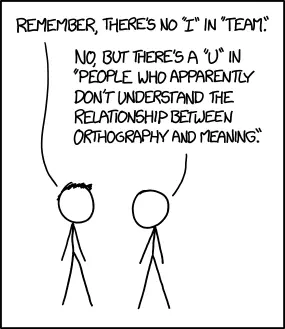

### Beyond the individual

What happens at Dwarves isn't about any single person, not the CEO, not the core team, not anyone. We're all here because we want to unite our efforts to achieve excellence in software engineering and empower innovation.

The Dwarves is more like an ideology than a conventional company. When we started, we were excited about making this ideology real, creating positive impact, and building meaningful livelihoods.

Our resources are allocated accordingly. We establish guidelines for everyone pursuing this shared path, everyone who wants to contribute and make innovative products possible. We work together toward a greater good because when it becomes about individuals alone, things fall apart.

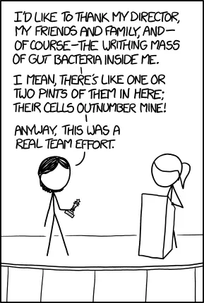

### Finding like-minded people

We founded this team with purpose: to power innovation. Our long-term goal is to create an environment where new ideas flourish, where we develop meaningful technologies and create positive impact. We aim to build a place where engineers can work with groundbreaking startups while enjoying what they do.

Achieving this vision requires significant dedication and commitment. That's why we seek like-minded people who share our vision, DNA, and energy. We value those who think differently, see things clearly, and remain optimistic about the future.

### Valuing uniqueness

When hiring, we look for what makes each person special. We hire for unique value, for what you bring to the table that differentiates you from others.

Being different is always valuable. These differences can take many forms: thinking style, technology vision, operational approach, presentation skills, communication ability, leadership capability, prototyping speed, emotional intelligence, or countless other qualities.

We strive to be an organization that respects and leverages these unique qualities rather than reducing people to standardized technical evaluations like school exams.

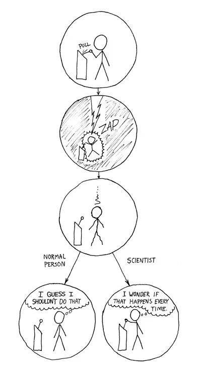

### The importance of emotional intelligence

We've seen many brilliant engineers with high IQs struggle while others with strong emotional intelligence succeed. Often, the difference comes down to communication.

Clients frequently tell us what feature they want rather than what problem they need to solve. Failing to see beyond their request can lead to situations where implementing the requested feature becomes technically impossible, while alternative approaches to the underlying problem remain unexplored. This dynamic explains why clients prefer working with some teams over others.

As a software firm, our job is to recommend solutions, not just implement features. Technical tasks, bugs, and features are just one side of the coin; understanding the real problem is the other. Train yourself to see the bigger picture.

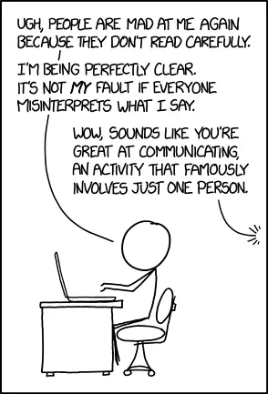

### Actions over words

People judge you by what you do, not what you say. Be a doer. We craft software to create positive impact.

At Dwarves, we value building over talking. We prefer to work with those who contribute tangible value and make things happen.

We pursue a culture that balances unconventional thinking with doing the right thing in every decision, not simply following established patterns.

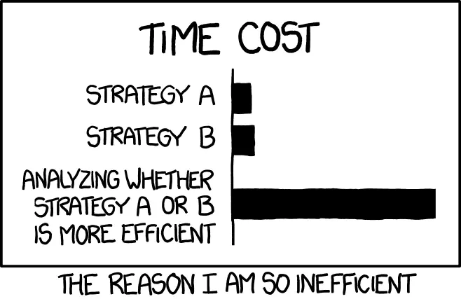

## How we work

### Remote by default

We don't micromanage your physical presence. We have more important priorities than tracking your location minute by minute. We reserve meetings for decision-making, while ideas and planning can happen asynchronously.

However, flexibility requires responsibility. Flexible work arrangements are powerful but require self-management. You need to know what must be done each day, what's a priority, and what can wait.

Work can happen anywhere, whether in your kitchen or at the beach. We want you to manage your work on your terms. Just make sure you know what needs to happen and how you'll accomplish it.

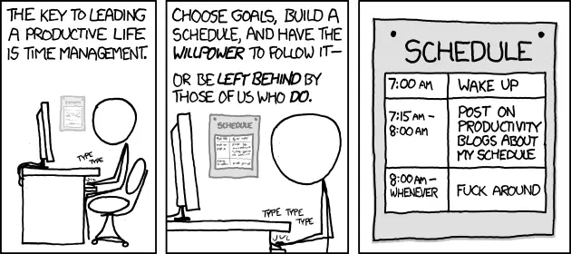

### Quality over hours

We work for our collective future. We care about the quality of what we produce rather than the number of hours worked. We don't enforce specific start or end times.

Our team operates across different time zones, staying connected around the clock. Dwarves are available when needed, but we respect each other's work-life balance. Don't take advantage of someone's availability.

### Automation mindset

Time is our most precious resource. The techniques and technologies we embrace help us save time through automation. If something happens more than three times and will likely recur, we find a way to automate it.

As software transforms the world, tasks we perform today can be automated tomorrow. With our engineering capabilities, we can eliminate repetitive work and focus on what truly matters. Don't repeat yourself.

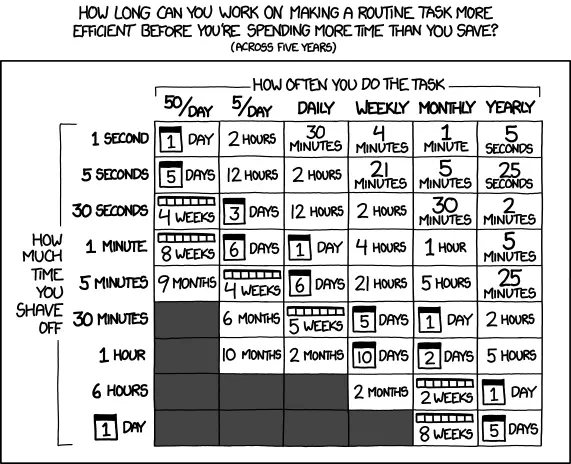

### Going beyond expectations

The Dwarves often spend their free time exploring new technologies and working on side projects. This extra effort extends our capabilities and increases our chances of reaching new heights.

Putting in that additional 20% effort represents our commitment to excellence. While not required, it's encouraged and rewarded when the things we build bring value to customers or reach the market successfully.

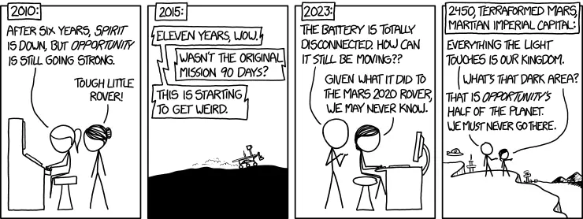

### Purpose-driven work

We focus on results, ensuring every action brings us closer to our goals. When consulting with clients, we must understand what makes a collaboration successful.

Remote clients often worry about delivery. Without updates, they assume no progress. While we don't monitor where you work, transparency is crucial. Detailed planning and regular reports build trust. Insisting on daily status meetings often indicates trust issues rather than effective agile practices.

To succeed with clients:

- Make development progress as transparent as possible
- Be a team player, not just a "task worker"
- Favor open discussion and alternative recommendations over simply rejecting client requests

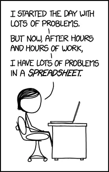

### Building partnerships, not transactions

In our work with others, we pursue partnerships, not just business. We value lifetime relationships. While deals and markets come and go, trusted clients remain. Once people experience our well-crafted work, they rarely want to risk working with alternatives. The quality speaks for itself.

Similar to networking, business is about giving before taking. We often contribute value upfront before asking for anything in return.

Unfortunately, many approach business asking "what can you do for me?" rather than "how can we grow together?" Whether due to skepticism or past disappointments, many business owners focus on immediate gains rather than investing in sustainable, long-term relationships.

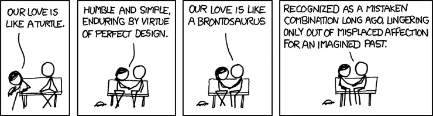

### Everyone contributes directly

Everybody works. In a small team, we need people who do the work, not just assign it. Everyone must contribute directly. No one stands above the actual work.

This means avoiding "delegators," people who primarily tell others what to do. They create bottlenecks by generating busywork and making up new tasks when they run out of things to assign, regardless of actual needs.

Delegators gravitate toward meetings, where they appear important while pulling others away from productive work.

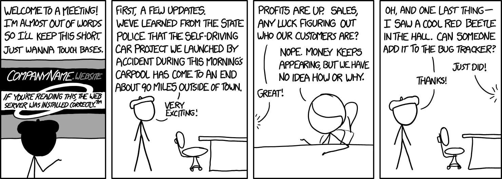

### Effectiveness over busyness

Being productive means filling your schedule and completing many tasks. Being effective means having more unoccupied time for things beyond work. We value effectiveness, not busyness.

We focus on creating the most value possible in the time available. Between signal and noise, we choose signal and filter out distractions.

Know your priorities and focus on what truly matters.

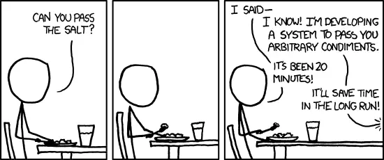

## Engineering culture

We're building a company where software engineering excellence shines, where innovative products ship and change the world for the better.

### Engineering discipline

Software engineering applies systematic approaches to software development. Without proper methods, software becomes more expensive and less reliable over time. As changes accumulate, costs increase dramatically.

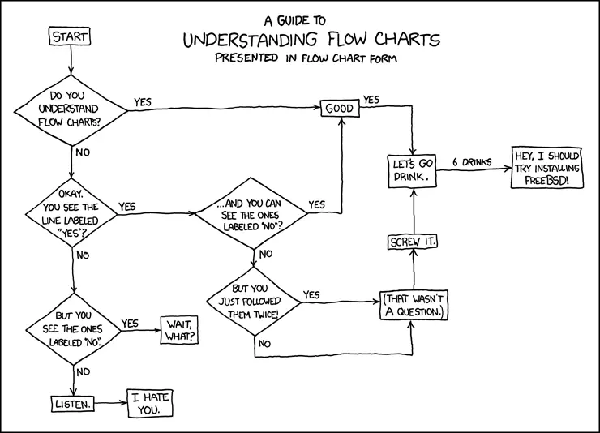

### Valuing craftspeople

In every software project, the engineering team is critical to success. Software development is more craft than assembly line, and engineers aren't interchangeable parts.

The assembly line mindset is an industrial age relic. We reject standardized interview processes with arbitrary whiteboard problems that diminish individuality and treat engineers as replaceable components.

### Meritocracy of ideas

If you have a great idea and the determination to implement it, you can create significant change. Nothing is off-limits. We constantly seek improvements in our people, processes, and products. Every voice matters, regardless of role or seniority.

If your idea makes the most sense, that's what we'll pursue.

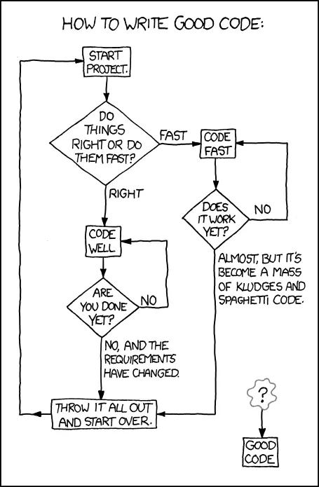

### Lean thinking

The lean philosophy considers anything that doesn't add customer value as waste. To eliminate waste, we must recognize it. Partially completed work, unnecessary processes, unused features, rework, overly complex solutions, waiting time, and management overhead not producing real value all qualify as waste.

Results matter more than approach or process. Fancy tools and complicated procedures often create more problems than they solve.

Always remember you're the manager of one. Know what success looks like and what your priorities are. There will always be distractions and misleading directions. Focus on the signal and filter out the noise.

Favor proven, straightforward solutions over shiny new technologies chasing popularity. Be practical and don't waste effort on uncertainties.

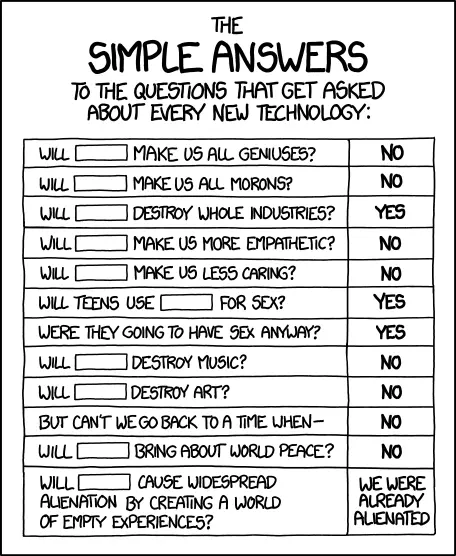

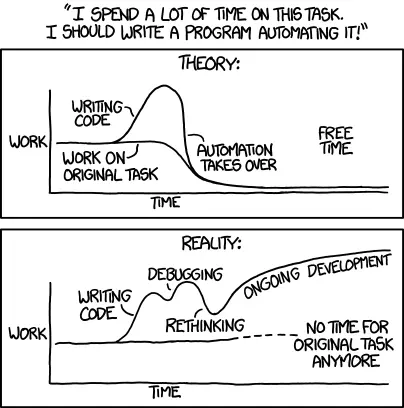

### Long-term thinking

How do we know if we're making the right decisions?

Every action creates chains of cause and effect. When making decisions, we follow a shared framework based on collective benefit rather than individual gain.

Today's decisions impact our future. The technologies we adopt, the solutions we implement, the founders we support, the startups we invest in, the people we hire, and how we treat clients all create lasting impacts. Even how we talk about ourselves and our attitude toward peers matters.

Everyone at Dwarves has the authority to make decisions as long as they benefit the whole organization in the long run rather than serving short-term individual interests. It's like walking a tightrope, requiring careful balance.

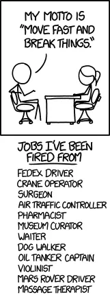

## Building the future

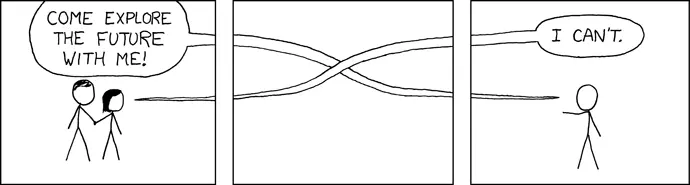

### Software's expanding role

Software runs our world. It surrounds us, though few people consider how deeply it impacts daily life. Businesses use software to communicate globally. It operates complex medical equipment. It makes our lives more convenient in countless ways.

Software is transforming every industry. Whatever the future holds, software will remain essential. As it becomes more sophisticated, it will help us tackle increasingly complex challenges.

In the future, software may even help regulate and improve our bodies. Today's wearable devices and medical implants are just the beginning of what next-generation software will enable.

The tech industry sits at the intersection of all sectors. It's our fastest-evolving environment and the frontier where humanity pushes boundaries. It's our pathway to the future. Organizations increasingly depend on integrating digital technology into their core strategies. Our world can no longer function without software.

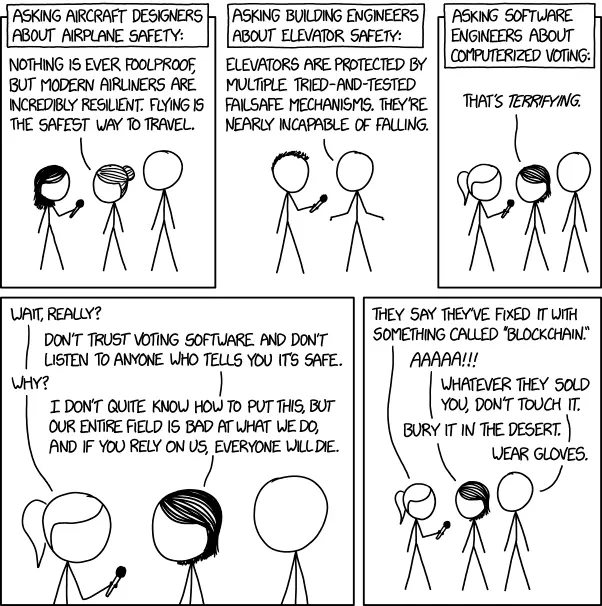

### Creating a resilient future

Humanity faces tremendous opportunities to expand possibilities across sectors. The future ahead is dynamic and exciting. Without carefully considering the impact of our actions on future generations, we risk unintentionally causing harm.

As an ambitious team co-creating the future with startups and makers, we must remain mindful of our actions and maintain a long-term perspective. This awareness helps us avoid short-sighted decisions and build a sustainable future.

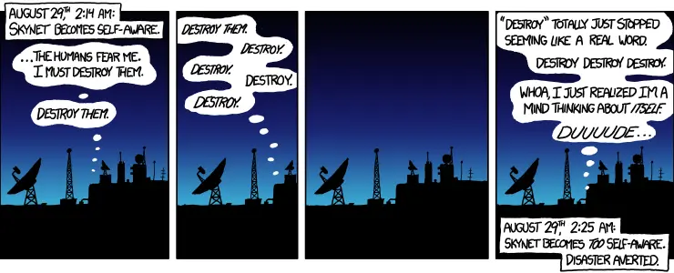

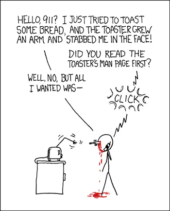
